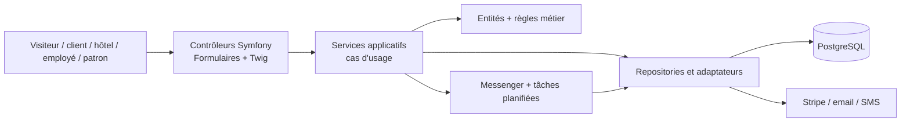

# Architecture — TI Baleine App

**Version :** v1 — 20/08/2026

**Équipe :** 200ping

**État :** architecture cible avant création du projet Symfony

**Décisions associées :** `adr/ADR-001-stack.md` à
`adr/ADR-006-persistance.md`

Ce document est la carte technique du dépôt. Il indique à un développeur ou à
un agent IA quelles sources lire, où placer le code et quelles décisions ne
doivent pas être inventées.

> **État réel du dépôt au 20/08/2026 :** l'application Symfony n'est pas encore
> créée. `src/` contient seulement `.gitkeep`. Il n'existe pas encore de
> `composer.json`, `config/`, `public/`, `templates/`, `translations/`,
> `migrations/` ni de configuration PHPUnit. Les fichiers PHP sous `tests/`
> sont des prototypes issus de la conception, pas du code Symfony de production
> directement réutilisable.

---

## 0. Sources de vérité et ordre de lecture

### 0.1 Où trouver chaque élément

| Élément recherché | Emplacement vérifié | Règle d'utilisation |
|---|---|---|
| Besoin client applicable | `cahiers_des_charges/Cahier_des_charges_200ping_V5.md` | La V5 remplace les V1 à V4 pour l'implémentation. Les anciennes versions restent historiques. |
| Origine des besoins | `compte_rendu/compte-rendu-entretien-01.md` à `-05.md` | À consulter pour comprendre une exigence ou vérifier sa source. |
| Dernier changement client | `impacts/impact-CR-001.md` | Explique le passage à l'acompte, au solde, aux nouveaux états et aux documents. |
| Spécifications | `../specs/` | Lire la SPEC principale et son éventuel fichier `-A1`. L'amendement applicable prévaut sur les points qu'il modifie. |
| Cas de test métier | `../tests/cases/` | Un fichier `CASE-*.md` décrit le comportement attendu et cite sa SPEC. |
| Prototypes PHPUnit | `../tests/phpunit/` | À adapter à Symfony/PHPUnit ; ils ne sont pas actuellement exécutables faute de projet Composer. |
| Prototypes métier | `../tests/entite_test/`, `../tests/service/`, `../tests/exception/` | Sources de compréhension uniquement. Le code de production doit vivre dans `src/`. |
| Anciens tests | `../tests/old_test_files/` | Historique : ne pas prendre comme référence ni intégrer à la suite active. |
| Modèle conceptuel courant | `mcd/mcd-V3.md` et `mcd/mcd-V3.dbml` | Référence pour les concepts, attributs et cardinalités. |
| Modèle logique courant | `mld/mld-V3.md` | Référence pour les tables, clés et contraintes. |
| Modèle physique illustré | `mpd/MPD.puml`, `mpd/MPD.drawio`, `mpd/MPD.svg` | À comparer au MLD V3 avant les migrations ; ne prévaut pas sur lui. |
| Cas d'utilisation | `cas_utilisation/v2/` | Version la plus récente présente dans le dépôt. |
| Séquences | `uml/sequences/v1/`, `v2/`, `v3/` | Prendre la version la plus récente du parcours et la confronter aux specs V5/A1. |
| Diagrammes de classes | `diagramme_de_classe/` | Illustrations ; le MCD/MLD V3 reste prioritaire pour les données. |
| Décisions techniques | `adr/ADR-001-*.md` à `adr/ADR-006-*.md` | Tous les ADR sont actuellement au statut `proposé`. Toute décision irréversible doit être confirmée par l'équipe. |
| Bibliothèques envisagées | `../LIBRARIES.md` | Liste recommandée, pas une preuve que les paquets sont installés. |
| Périmètre d'une tâche IA | `delegation/delegation-<SPEC>.md` | Définit les fichiers autorisés, la SPEC et le CASE à faire passer au vert. |
| Matrice de traçabilité | `traceability_v2.md` | Générée par `../tools/traceability_v2.sh`, à ne pas modifier manuellement. |
| Questions ambiguës | `corrections-generees-par-ia/questions-ambigues.md` et les sections « Ce qui n'est pas défini » des specs | Ne pas inventer une réponse métier. |
| Historique des décisions IA | `journal.md` | Sert à la revue humaine, pas à créer une règle métier. |
| Maquette Figma | **Absente du dépôt et aucun lien trouvé** | Ajouter le lien ou les exports avant l'intégration visuelle. Sans cela, aucune fidélité à Figma ne peut être exigée. |

### 0.2 Priorité en cas de contradiction

Pour développer une fonctionnalité, lire dans cet ordre :

1. le cahier des charges V5 et `impacts/impact-CR-001.md` ;
2. la SPEC concernée et son amendement `-A1` éventuel ;
3. les CASE rattachés à cette SPEC ;
4. le MCD/MLD V3 pour les données ;
5. les ADR pour les choix techniques ;
6. le fichier de délégation pour le périmètre de modification.

Une règle plus récente et explicitement applicable prévaut sur un document
historique. Une contradiction non arbitrée doit être signalée, jamais résolue
silencieusement par le code.

Points déjà identifiés :

- `ADR-003-cycle-de-vie-reservation.md` décrit encore `payée | annulée` et est
  contredit par la V5, le MCD/MLD V3 et les specs amendées. La cible actuelle
  est un état `réservée | réalisée | annulée`, séparé du statut de paiement
  `en_attente_paiement | acompte_paye | integralement_paye | rembourse` ;
- les textes historiques parlant de paiement intégral à la réservation sont
  remplacés par la V5 : acompte en ligne de 30 % en standard et 50 % en
  privatisation, sauf hôtels facturés mensuellement ;
- les noms des fichiers de spécification commencent actuellement par `## `.
  Utiliser leur chemin réel et ne pas les renommer pendant une tâche de code
  sans accord de l'équipe.

---

## 1. Vue d'ensemble

TI Baleine App est une application web Symfony monolithique, rendue côté
serveur. Symfony/Twig porte les pages ; les services applicatifs orchestrent les
cas d'usage ; les entités, enums et services métier portent les règles ; Doctrine
persiste les données dans PostgreSQL. Stripe, l'email et le SMS restent derrière
des adaptateurs pour pouvoir être simulés dans les tests et gérer leurs pannes
(`REQ-020`).



L'application n'est pas conçue comme une API REST séparée ni comme un frontend
Next.js. Cette cible correspond à l'ADR-001 et aux composants Form/Twig cités
dans `LIBRARIES.md`. Un changement exige un nouvel ADR avant développement.

---

## 2. Stack cible

| Besoin | Choix vérifié | État actuel |
|---|---|---|
| Backend | PHP / Symfony (`ADR-001`) | Versions PHP/Symfony non précisées ; à fixer avant `composer create-project`. |
| Environnement local | Docker + Docker Compose | À créer pour fournir PHP/Symfony et PostgreSQL avec les mêmes versions à toute l'équipe. |
| Interface | Twig, Symfony Form et Validator (`LIBRARIES.md`) | Non installés ; maquette Figma absente. |
| Persistance | Doctrine ORM + migrations, PostgreSQL (`ADR-001`, `ADR-006`) | Pas de base ni de migration. |
| Authentification | Symfony Security | Non configuré. |
| Paiement | Stripe SDK PHP (`ADR-002`) | ADR au statut `proposé`, aucune configuration. |
| Email et SMS | Symfony Mailer + Notifier | Prestataires email/SMS non tranchés. |
| Asynchrone | Symfony Messenger + cron (`LIBRARIES.md`) | Transport et hébergement compatibles non choisis. |
| Traduction | Symfony Translation, FR/EN | Catalogues non créés. |
| Documents PDF | Dompdf recommandé, KnpSnappy alternatif | Choix définitif non consigné dans un ADR. |
| Tests | PHPUnit, fixtures Doctrine, Panther éventuel | Aucun manifeste Composer/PHPUnit présent. |

Les exemples de `LIBRARIES.md` sont illustratifs. Ils ne constituent pas encore
l'application.

---

## 3. Couches et dépendances

| Couche | Responsabilité | Peut appeler | Interdit |
|---|---|---|---|
| Présentation | Routes, contrôleurs, formulaires, validation d'entrée, templates et réponses HTTP | Application | Doctrine direct, calcul financier, règle d'annulation/capacité |
| Application | Orchestrer un cas d'usage et sa transaction | Domaine, repositories et ports externes | Dupliquer les règles dans les contrôleurs ou construire une réponse Stripe |
| Domaine | États, invariants, calculs, annulation, disponibilité et autorisations métier | Autres objets du domaine | Symfony HTTP, Twig, Stripe, SMS, email ou PostgreSQL |
| Infrastructure | Doctrine, Stripe, Mailer/Notifier, Messenger, PDF et horloge | Services externes et interfaces internes | Décider d'un taux, remboursement ou changement d'état |

Règles de dépendance :

- un contrôleur lit la requête, appelle un service puis produit une réponse ;
- aucune règle métier ne vit dans Twig, JavaScript, un repository ou un handler
  Messenger ;
- le domaine manipule les montants avec une représentation exacte, jamais avec
  des nombres flottants ;
- Stripe, email, SMS et l'heure courante passent par une interface remplaçable
  en test ;
- les droits sont toujours contrôlés côté serveur, même si un bouton est caché.

---

## 4. Arborescence applicative cible

Cette arborescence doit être créée à l'initialisation Symfony. Elle ne décrit pas
des fichiers déjà présents.

```text
src/
├── Controller/                 # routes et réponses HTTP
├── Form/                       # formulaires Symfony et contraintes de saisie
├── Entity/                     # entités Doctrine et invariants simples
├── Enum/                       # états, statuts, rôles, types et canaux
├── Repository/                 # Doctrine, sans règle métier
├── Service/
│   ├── Reservation/            # réservation, disponibilité, blocage, modification
│   ├── Paiement/               # acompte, solde, idempotence, remboursements
│   ├── Annulation/             # barèmes et transitions d'annulation
│   ├── Facturation/            # documents et facturation hôtel
│   └── Notification/           # orchestration des messages et alertes
├── Security/                   # authenticator, voters et rôles
├── Integration/
│   ├── Stripe/
│   ├── Mail/
│   ├── Sms/
│   └── Pdf/
├── Message/                    # messages asynchrones sans logique métier
├── MessageHandler/             # chargement puis appel du service applicatif
├── Command/                    # commandes planifiées
└── Exception/                  # erreurs métier/applicatives explicites

templates/
├── base.html.twig
├── reservation/
├── compte/
├── hotel/
├── administration/
├── emails/
└── documents/

translations/                   # messages.fr.yaml et messages.en.yaml
migrations/                     # migrations Doctrine versionnées
config/                         # sécurité, Doctrine, Messenger, Mailer
public/                         # point d'entrée et assets publics
Dockerfile                      # image PHP/Symfony du projet
compose.yaml                    # application, PostgreSQL et services locaux
.docker/                        # configuration des images et services Docker
tests/
├── Unit/                       # domaine pur
├── Integration/                # Doctrine et adaptateurs simulés
├── Functional/                 # routes, formulaires et autorisations
└── cases/                      # cas d'acceptation Markdown existants
```

Les prototypes de `tests/entite_test/`, `tests/service/` et `tests/exception/`
doivent être relus puis remplacés par les classes réelles. Ils ne sont pas à
copier automatiquement : certains représentent un modèle antérieur à la V5
(`Facture`, `Remboursement`, `Supplement`, etc.), alors que le MLD V3 retient
huit tables différentes.

---

## 5. Emplacement des règles métier sensibles

Les chemins suivants sont les responsables cibles. Une règle ne doit pas migrer
vers un contrôleur ou un adaptateur externe.

| Règle | Référence | Responsable cible |
|---|---|---|
| Capacité de 12/24 places jamais dépassée | `REQ-008`, `REQ-019`, `SPEC-DISP-01`, `SPEC-BOOK-03-A1` | `Service/Reservation/DisponibiliteService.php` + transaction PostgreSQL |
| Blocage 15 min formulaire puis 15 min paiement | `REQ-019`, `SPEC-BOOK-03-A1`, `ADR-005` | `Service/Reservation/BlocagePlacesService.php` + expiration atomique |
| Acompte 30 % / 50 % | `REQ-021`, `SPEC-PAY-01`, `SPEC-PAY-01-A1` | `Service/Paiement/CalculAcompte.php` |
| Confirmation après acompte | `REQ-001`, `SPEC-BOOK-01`, `SPEC-BOOK-03-A1` | `Service/Reservation/ReservationService.php` dans une transaction |
| État séparé du statut financier | `REQ-025`, V5 R-90/R-91/R-101 | `Entity/Reservation.php` + enums et transitions métier |
| Webhooks et confirmations uniques | `REQ-108`, `SPEC-PAY-01-A1`, `SPEC-SYST-01-A1` | `Service/Paiement/ConfirmationPaiementService.php` + unicité DB |
| Solde H-24/H-12 et tentative en cours | `REQ-022`, `SPEC-PAY-BALANCE-02-A1` | `Service/Paiement/SoldeService.php` + `Command/`/Messenger |
| Solde sur place par le patron seulement | `REQ-023`, `SPEC-PAY-BALANCE-02-A1` | `Service/Paiement/PaiementSurPlaceService.php` + voter |
| Barème d'annulation sur montant initial | `REQ-007`, `REQ-009`, `SPEC-CANCEL-CLIENT-01-A1` | `Service/Annulation/PolitiqueAnnulation.php` |
| Annulation prestataire : remboursement ou report | `REQ-017`, `SPEC-CANCEL-PRESTATAIRE-02-A1` | `Service/Annulation/AnnulationSortieService.php` |
| Remboursement après avertissement | `REQ-018`, `SPEC-CANCEL-CLIENT-AVERTISSEMENT-03-A1` | `Service/Annulation/PolitiqueAnnulation.php` |
| Modification avec acompte figé | `REQ-010`, `SPEC-MODIF-01-A1` | `Service/Reservation/ModificationReservationService.php` |
| Hôtel : 6 places max, sans privatisation | `REQ-011`, `REQ-012`, `SPEC-BOOK-02-A1`, `SPEC-HOTEL-01-A1` | `Service/Reservation/ReservationHotelService.php` |
| Facture hôtel mensuelle et remise 15 % | `REQ-013`, `SPEC-FACT-01-A1` | `Service/Facturation/FacturationHotelService.php` |
| Alertes et historique des envois | `REQ-016`, `SPEC-ALERT-01`, `ADR-004` | `Service/Notification/NotificationService.php` + adaptateurs |
| Justificatif et facture finale | `REQ-024`, `SPEC-JUSTIF-01` | `Service/Facturation/DocumentService.php` + `Integration/Pdf/` |
| Contenus FR/EN | `REQ-014`, `REQ-107`, `SPEC-LANG-01` | `translations/`, aucune chaîne client en dur |

Chaque implémentation et test conserve les identifiants SPEC/CASE conformément à
la chaîne de traçabilité du `README.md`.

---

## 6. Modèle de données et transactions

La référence courante est `mcd/mcd-V3.dbml`, documentée dans `mcd/mcd-V3.md`
et `mld/mld-V3.md`. Elle contient huit concepts : `Utilisateur`, `Bateau`,
`Sortie`, `Reservation`, `Paiement`, `Tarif`, `Notification` et `Document`.

Conséquences architecturales :

- `Utilisateur.email`, `Paiement.reference_externe` et `Document.reference`
  sont uniques en base ;
- une réservation possède plusieurs opérations financières ; le statut global
  ne remplace pas leur historique ;
- une confirmation Stripe est traitée dans une transaction et dédupliquée par
  `reference_externe` ;
- vérification des places, blocage et confirmation forment une section atomique.
  Un comptage suivi d'un `INSERT` sans verrouillage est interdit ;
- l'expiration est vérifiée lors de toute réservation et par une tâche de
  nettoyage idempotente ;
- les montants utilisent `DECIMAL` en base et une représentation exacte en PHP ;
- les migrations sont testées sur PostgreSQL, pas sur une autre base.

> **Concurrence (`SPEC-BOOK-03-A1`) :** le service de disponibilité ouvre une
> transaction PostgreSQL, verrouille le créneau (verrou pessimiste ou opération
> atomique équivalente), recompte réservations et blocages non expirés, puis
> accepte ou refuse. Au maximum une demande obtient les dernières places.

Éléments absents ou incohérents dans le MLD V3, à arbitrer avant migration :

- représentation du blocage et de ses deux expirations ;
- données du lien de solde et de la tentative de paiement en cours ;
- `Reservation.document` ne permet qu'un document par réservation alors que
  `REQ-024` demande un justificatif puis une facture finale ;
- la privatisation exceptionnelle sur deux bateaux (V5 R-28) n'est pas
  représentable avec une sortie liée à un seul bateau ;
- fuseau horaire des échéances H-24/H-12.

L'agent ne doit pas ajouter des colonnes arbitraires pour contourner ces écarts.
Il les signale dans la tâche concernée pour validation humaine.

---

## 7. Services externes et traitements planifiés

| Service | Usage | Indisponibilité / limite actuelle |
|---|---|---|
| Stripe | Acompte, solde, liens, confirmations et remboursements tracés | L'application reste utilisable. Une confirmation invalide ne valide rien ; une référence répétée ne rejoue jamais l'opération (`SPEC-SYST-01-A1`). |
| Email | Confirmation, alertes, lien de solde, documents | Prestataire non choisi. Un échec à H-24 ne supprime pas la dette ; le patron voit le solde restant. Retry non défini. |
| SMS | Avertissement et annulation | Prestataire non choisi. L'application ne tombe pas en panne ; bascule email/retry/perte restent à préciser. |
| Alerte site | Avertissement sur les créneaux concernés | Persistée comme `popup_site`, sans destinataire individuel selon MCD V3. |
| PDF | Justificatifs et factures | Dompdf seulement recommandé. Contenu légal, numérotation et format restent ouverts. |

Les commandes idempotentes et Messenger gèrent :

- l'avertissement météo à 18 h la veille (`REQ-016`) ;
- le lien de solde à H-24 (`REQ-022`) ;
- le refus d'une nouvelle tentative en ligne à H-12, sans rejeter une tentative
  commencée avant (`SPEC-PAY-BALANCE-02-A1`) ;
- la libération des blocages expirés (`REQ-019`) ;
- la facturation hôtel, déclenchée par le patron (`SPEC-FACT-01-A1`).

Un message pouvant être livré plusieurs fois, chaque handler est idempotent et
délègue la décision métier au service responsable.

---

## 8. Sécurité et contrôle d'accès

| Rôle métier | Rôle Symfony proposé | Peut faire | Ne peut pas faire |
|---|---|---|---|
| Visiteur | aucun | Voir les créneaux, commencer une réservation, créer un compte | Voir des réservations privées ou l'administration |
| Client | `ROLE_USER` | Réserver, payer, consulter ses réservations/documents, demander une annulation | Voir une autre réservation, modifier comme le patron, encaisser sur place |
| Hôtel | `ROLE_HOTEL` | Voir ses réservations, utiliser le parcours hôtel | Privatiser, dépasser 6 places, accéder aux fonctions internes |
| Employé | `ROLE_EMPLOYEE` | Consulter les réservations en lecture seule | Modifier, annuler, encaisser ou administrer |
| Patron | `ROLE_ADMIN` | Gérer réservations, sorties, annulations, paiements sur place et facturation | Fonction non prévue par le cahier des charges |

Les rôles Symfony sont mappés aux valeurs MLD `utilisateur`, `hotel`, `employe`,
`administrateur`. Les voters vérifient rôle et propriété de la ressource. Les
webhooks Stripe vérifient leur signature sans dépendre d'une session.

Mesures transversales : mots de passe hachés, CSRF, validation serveur, secrets
hors Git, logs sans données bancaires ni secrets et collecte minimale RGPD
(`REQ-101`). La durée du lien d'authentification email et la conservation des
données ne sont pas définies.

---

## 9. Interface et Figma

Aucun fichier Figma, lien Figma, export d'écran ou mapping écran/route n'est
présent. Les images de `uml/` et `cas_utilisation/` sont des diagrammes, pas des
maquettes d'interface.

Avant l'intégration visuelle, fournir :

- le lien Figma lisible ou les exports complets ;
- les écrans desktop/mobile et leurs états vide, erreur, chargement et succès ;
- composants, couleurs, typographies, icônes et règles responsive ;
- le mapping de chaque écran vers sa route Symfony et ses SPEC/CASE.

Sans ces éléments, l'IA peut créer les parcours Twig fonctionnels, mais pas
prétendre reproduire exactement la maquette. L'interface client reste responsive,
accessible (`REQ-105`, `REQ-106`) et bilingue (`REQ-107`).

---

## 10. Tests, validation et traçabilité

```text
CR → REQ → SPEC (+ A1) → CASE → test automatisé → code → commit
```

Stratégie cible :

- unitaires pour calculs, politiques, transitions et idempotence ;
- intégration PostgreSQL pour contraintes, transactions et concurrence ;
- fonctionnels Symfony pour routes, formulaires, rôles et propriété ;
- doubles pour Stripe, email, SMS, PDF et horloge ;
- tests navigateur limités aux parcours critiques et au responsive.

```bash
# Disponible maintenant ; régénère la matrice.
bash tools/traceability_v2.sh --check

# Cible après initialisation Symfony/Composer ; impossible actuellement.
php bin/phpunit
```

Ne pas lancer le script de traçabilité pendant une simple revue : il réécrit
`docs/traceability_v2.md`. Aucun code n'est accepté avant le CASE visé et les
tests de non-régression.

---

## 11. Déploiement et exploitation

La cible n'est pas décidée. `ADR-001` évoque un hébergement mutualisé PHP autour
de 5 €/mois, mais son tableau indique aussi 0 €/mois ; aucun hébergeur, CI/CD ou
responsable de production n'est nommé.

Docker et Docker Compose constituent l'environnement de développement et de
test reproductible. Le `Dockerfile` fixe la version de PHP et les extensions
requises par Symfony/Doctrine ; `compose.yaml` démarre au minimum l'application
et PostgreSQL. Les données locales de PostgreSQL sont conservées dans un volume
nommé et les secrets ne sont jamais écrits dans l'image. L'utilisation de la
même image en production dépendra de l'hébergeur retenu.

Le choix final doit supporter :

- les versions retenues de PHP/Symfony et PostgreSQL ;
- les secrets Stripe, mail et SMS ;
- les migrations Doctrine ;
- un worker Messenger supervisé ;
- cron à 18 h, H-24/H-12 et l'expiration des blocages ;
- HTTPS, sauvegardes PostgreSQL, logs et restauration ;
- un fuseau métier explicite, indépendant du serveur.

Sans hébergeur choisi, ne pas dépendre silencieusement d'un worker permanent,
d'un cron à la minute ou d'un stockage local durable.

---

## 12. Limites et décisions restant à prendre

- versions PHP et Symfony ;
- versions des images Docker et services définis dans `compose.yaml` ;
- remplacement officiel de l'ADR-003 obsolète ;
- validation des ADR encore tous `proposé` ;
- schéma des blocages, tentatives et liens de paiement ;
- modèle permettant deux documents par réservation et deux bateaux dans le cas
  exceptionnel d'une privatisation ;
- fuseau horaire, précision des échéances et arrondis monétaires ;
- prestataires SMS/email et politique retry/fallback ;
- contenu légal, numérotation et conservation des documents ;
- durée des liens de connexion et conservation RGPD ;
- hébergeur, budget réel, sauvegardes et responsable de déploiement ;
- lien ou exports de la maquette Figma.

Une fonctionnalité indépendante de ces points peut avancer. Une tâche qui en
dépend obtient d'abord l'arbitrage, met à jour sa SPEC/ADR/modèle, puis seulement
génère le code et les tests.
