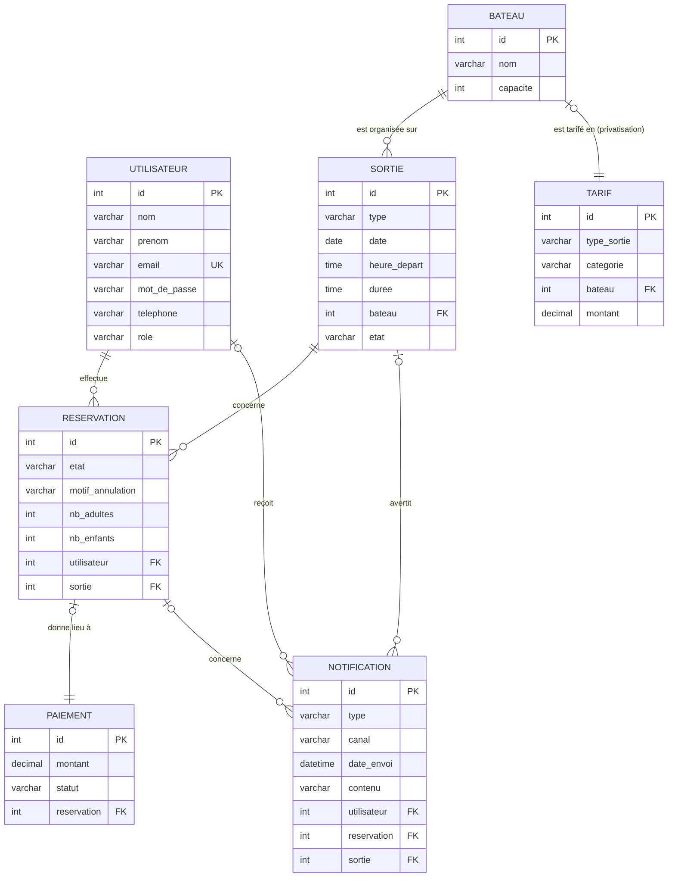

# MCD — Modèle Conceptuel de Données

| Informations            | Détails                                        |
| ----------------------- | ---------------------------------------------- |
| **Projet**              | TI Baleine App                                 |
| **Équipe**              | 200ping                                        |
| **Version**             | v2 (14/08/2026) · v1 (12/08/2026)             |
| **Source**              | `Cahier_des_charges_200ping_V2.md` (V2.0), CR-01, CR-02, CR-03 + SPEC brouillons `SPEC-BOOK-01/02`, `SPEC-CANCEL-01/02/03` |
| **Date**                | 14/08/2026 (V2) · 12/08/2026 (V1)               |
| **Décision associée**   | `adr/ADR-001-stack.md` (persistance : Doctrine) |

> **Changements V1 → V2 (confirmés équipe 14/08/2026) :**
> - `Réservation.état` : ajout de l'état **`payée`** (SPEC-BOOK-01) ;
> - `Sortie` : ajout d'un **état** (`planifiée` / `avertie` / `annulée`) —
>   avertissement météo la veille à 18 h, annulation ≥ 2 h avant le départ,
>   **par créneau** (SPEC-CANCEL-02) ;
> - nouvelle entité **`Notification`** : trace des envois SMS / email / pop-up
>   site (SPEC-BOOK-01, SPEC-CANCEL-02/03) ;
> - `Paiement` : ajout du **`statut`** de remboursement (SPEC-CANCEL-01/02/03) ;
> - **pas** de `type_annulation` sur `Réservation` (décision équipe 14/08/2026).

> **Règle de construction :** ce MCD est issu **uniquement** du cahier des charges
> et, pour les éléments qu'il ne précisait pas, des comptes-rendus d'entretien
> (CR-01, CR-02) qui en sont la source. Chaque élément cite son passage d'origine.
> Rien n'est ajouté sans source.
>
> **Rôles (décision équipe, corrigée le 12/08/2026) :** trois rôles —
> `utilisateur` (client), `employe` (salarié : consultation seule) et
> `administrateur` (patron : accès complet, dont modification).

---

## 1. Concepts du cahier retenus

| Concept | Justification (cahier) |
|---|---|
| **Utilisateur** | « Inscription », « Connexion (client et entreprise) », « Notification par mail », « Vérification des rôles » |
| **Sortie** (créneau réservable) | « organise des sorties baleine et dauphin et possibilité de privatisation pour d'éventuelles autres types de sorties », « Les clients peuvent réserver leurs créneaux », « Les horaires sont tous les jours de la semaine » |
| **Bateau** | « L'entreprise dispose de deux bateaux de 12 et 24 places » |
| **Réservation** | « Faire une réservation », « Paiement », « Demande d'annulation » |
| **Paiement** | « Paiement en ligne (client) », « Confirmation → Paiement » |
| **Tarif** | CR-01 §3 : « 65 € adulte 40 € enfant pour baleine, 50 € adulte et 30 € enfant pour dauphin. Privatisation … 600 € ti kap et 1 100 € pour grand bleu » |
| **Notification** | SPEC-BOOK-01 (email de confirmation + SMS au patron), SPEC-CANCEL-02 (avertissement 18 h / annulation ≥ 2 h), SPEC-CANCEL-03 (annulation client après avertissement) — alertes météo et notifications client |

La **demande d'annulation** et la **modification** ne sont pas des entités : ce
sont des règles portées par la `Réservation` (état + motif), voir §5.

---

## 2. Entités et attributs

### UTILISATEUR

| Attribut | Justification |
|---|---|
| Identifiant | identifiant technique (convention MCD) |
| Nom | décision équipe 12/08/2026 (reprise du MCD LucidChart) |
| Prénom | décision équipe 12/08/2026 (reprise du MCD LucidChart) |
| Email | « Notification par mail », « Connexion » ; CR-01/Q01 (email demandé à la réservation) |
| Mot de passe | « Connexion » — *nullable* dans le MCD LucidChart (mot de passe optionnel, à confirmer) |
| Téléphone | CR-01/Q03 : « Le client laisse son numéro de téléphone lors de la réservation. Appel si annulation. » |
| Rôle | décision équipe (corrigée le 12/08/2026) : `utilisateur` (client) / `employe` (salarié, consultation seule) / `administrateur` (patron, accès complet) — « Vérification des rôles → Accès à la vue concernée (client, salarié ou patron) » |

### SORTIE  *(créneau réservable)*

| Attribut | Justification |
|---|---|
| Identifiant | identifiant technique |
| Type | « sorties baleine et dauphin et possibilité de privatisation pour d'éventuelles autres types de sorties » (baleine, dauphin, privatisation…) ; CR-01/Q01 |
| Date | « Les horaires sont tous les jours de la semaine » ; CR-01/Q23 (tous les jours) |
| Horaire de départ | CR-01 §3 : créneaux 7 h, 10 h et 14 h |
| Durée | CR-01 §3 : 2 h 30 (baleine), 2 h (dauphin) |
| État | SPEC-CANCEL-02 : `planifiée` → `avertie` (avertissement 18 h la veille) → `annulée` (≥ 2 h avant) ; décision **par créneau** (le 7 h peut être annulé, le 10 h maintenu). La date de l'avertissement se déduit des `Notification` de type `avertissement` liées au créneau. |

> Une sortie baleine par créneau (CR-02 §1, CR-01/Q19) ; question ouverte n°1 du
> cahier : les types ne sont **pas** définis en avance en fonction du jour
> (hypothèse retenue). L'annulation météo se fait **par créneau** : le « bulk »
> du patron concerne toutes les sorties du même horaire (SPEC-CANCEL-02).

### BATEAU

| Attribut | Justification |
|---|---|
| Identifiant | identifiant technique |
| Nom | CR-01 §3 : Ti Kap et Grand Bleu |
| Capacité | « deux bateaux de 12 et 24 places » ; CR-01/Q02 : Ti Kap = 12 places, Grand Bleu = 24 places |

### RÉSERVATION

| Attribut | Justification |
|---|---|
| Identifiant | identifiant technique |
| État | « Paiement » + « Demande d'annulation » : `payée`, `annulée` (SPEC-BOOK-01) |
| Motif d'annulation | « Demande d'annulation → Envoi du motif » (renseigné uniquement si annulation) |
| Nombre d'adultes | CR-01/Q01 : « nombre de personnes (+ nombre d'adultes et d'enfants) » |
| Nombre d'enfants | CR-01/Q01 ; tranche d'âge enfant : 4-11 ans (CR-01/Q14, décision équipe 12/08/2026) |

> Minimum 2 personnes par réservation (CR-01 §3) ; minimum 6 personnes sur le
> bateau, pour les deux bateaux (CR-01/Q22, CR-02 §1) ; réservation bloquée
> 2 h avant le départ (SPEC-BOOK-01 cas 2).

### PAIEMENT

| Attribut | Justification |
|---|---|
| Identifiant | identifiant technique |
| Montant | calculé à partir de la table `Tarif` (CR-01 §3) |
| Statut | SPEC-CANCEL-01/02/03 : `paye`, `rembourse_partiel` (barème client), `rembourse_total` (annulation prestataire / client après avertissement) |

> Paiement **uniquement en ligne** (CR-01/Q07), « pas de prestataire fixe »
> (CR-01 §3 ; l'ADR-001 prévoit Stripe). Remboursement géré par le patron et
> crédité sur la carte bancaire du paiement (CR-02 §1) ; exécution **manuelle**
> (R-27), le `statut` ne fait que le tracer. Référence de la transaction non
> précisée : voir [questions encore ouvertes](#73-questions-encore-ouvertes).

### TARIF

| Attribut | Justification |
|---|---|
| Identifiant | identifiant technique |
| Type de sortie | CR-01 §3 : baleine, dauphin, privatisation |
| Catégorie | CR-01/Q14 + décision équipe : adulte (12 ans et +), enfant (4-11 ans) ; sans objet pour la privatisation |
| Bateau | CR-01 §3 : tarif de privatisation par bateau (600 € Ti Kap / 1 100 € Grand Bleu) |
| Montant | CR-01 §3 : 65/40 € baleine, 50/30 € dauphin |

### NOTIFICATION

| Attribut | Justification |
|---|---|
| Identifiant | identifiant technique |
| Type | SPEC-BOOK-01 / SPEC-CANCEL-02/03 : `avertissement`, `annulation`, `confirmation_demande`, `creneau_indisponible` |
| Canal | SPEC-CANCEL-02 (cas 1) : `sms`, `email`, `popup_site` |
| Date d'envoi | SPEC-CANCEL-02 : avertissement la veille à 18 h ; annulation ≥ 2 h avant le départ |
| Contenu | texte du message envoyé (trace) |
| Destinataire | `Utilisateur` concerné (nullable : un pop-up site n'a pas de destinataire individuel) |
| Réservation | réservation concernée (confirmation de prise en charge, annulation, créneau indisponible) |
| Sortie | créneau concerné (avertissement / annulation par créneau) |

> Règles portées : email de confirmation de prise en charge au client + SMS au
> patron à chaque demande (SPEC-BOOK-01) ; avertissement 18 h puis annulation
> ≥ 2 h avant, par créneau (SPEC-CANCEL-02) ; nouveau client réservant après
> l'avertissement : **pas de SMS/mail mais alerte pop-up sur le site**
> (SPEC-CANCEL-02 cas 1) ; hôtel : **pas de notification**, appel direct
> (SPEC-CANCEL-02 cas 2) ; client annulant après avertissement : remboursement
> intégral (SPEC-CANCEL-03).

---

## 3. Associations et cardinalités

| Association | Entité (card.) | Entité (card.) | Signification |
|---|---|---|---|
| **effectue** | UTILISATEUR (0,n) | RÉSERVATION (1,1) | un utilisateur effectue 0..n réservations ; une réservation est effectuée par un seul utilisateur |
| **concerne** | RÉSERVATION (1,1) | SORTIE (0,n) | une réservation concerne une seule sortie (créneau) ; une sortie est concernée par 0..n réservations |
| **donne lieu à** | RÉSERVATION (0,1) | PAIEMENT (1,1) | une réservation donne lieu à 0..1 paiement ; un paiement règle une seule réservation |
| **est organisée sur** | SORTIE (1,1) | BATEAU (0,n) | une sortie est organisée sur un seul bateau ; un bateau accueille 0..n sorties |
| **est tarifé en** | BATEAU (0,1) | TARIF (1,1) | un bateau a au plus un tarif de privatisation ; un tarif de privatisation concerne un seul bateau |
| **reçoit** | UTILISATEUR (0,n) | NOTIFICATION (0,1) | un utilisateur reçoit 0..n notifications ; une notification est adressée à 0..1 utilisateur (null pour pop-up site) |
| **concerne** | RÉSERVATION (0,n) | NOTIFICATION (0,1) | une réservation est concernée par 0..n notifications ; une notification concerne 0..1 réservation |
| **avertit** | SORTIE (0,n) | NOTIFICATION (0,1) | une sortie (créneau) est objet de 0..n notifications ; une notification concerne 0..1 sortie |

### 3.1 Représentation visuelle (Mermaid)

Le schéma ci-dessous se **rend nativement dans l'aperçu Markdown de VS Code**
(`Ctrl+Shift+V` ou bouton « Ouvrir l'aperçu ») — aucune extension à installer.
Il reprend les 7 entités avec leurs clés et les associations listées ci-dessus.

**Lecture des cardinalités (Mermaid) :** `||` = exactement un · `o{` = zéro ou
plusieurs · `o|` = zéro ou un. Par exemple `BATEAU ||--o{ SORTIE` se lit : un
bateau accueille 0..n sorties, une sortie est organisée sur un seul bateau.

---

## 4. Schéma des tables (DBML)

Le modèle de données est décrit en **DBML** dans [`mcd-V2.dbml`](mcd-V2.dbml) : un
fichier texte à ouvrir dans dbdiagram.io ou via l'extension « Database Markup
Language » de VS Code. Les relations y sont exprimées en `ref` avec les
cardinalités (0,n / 1,n / 1,1), cf. aussi les cardinalités Merise du §3.

Tables : `Utilisateur`, `Bateau`, `Sortie`, `Reservation`, `Paiement`, `Tarif`, `Notification`.

---

## 5. Règles métier portées par le modèle

Chacune est issue du cahier :

1. **Cycle de vie d'une réservation** : la réservation passe à l'état `payée`
   après paiement, puis peut passer à `annulée` sur demande du client ou
   décision du prestataire. (SPEC-BOOK-01, SPEC-CANCEL-01/02/03.)
2. **Annulation** : une réservation peut être annulée sur demande du client avec
   envoi d'un motif. (« Demande d'annulation → Envoi du motif → … → Rendez-vous
   annulé »)
3. **Modification** : hors périmètre V2 (REQ-010 non couverte — spec `MODIF-01`
   supprimée) ; les conditions de modification restent à définir.
4. **Capacité** : une sortie ne dépasse jamais la capacité du bateau (12 ou 24
   places). (« deux bateaux de 12 et 24 places »)
5. **Accès par rôle** : `utilisateur` (client) réserve et consulte ses propres
   réservations ; `employe` (salarié) consulte les réservations sans pouvoir
   modifier ; `administrateur` (patron) accès complet (consulter + modifier).
   (décision équipe corrigée le 12/08/2026 + « Vérification des rôles »)

Règles complémentaires confirmées dans les entretiens (CR-01, CR-02) :

6. **Annulation client** : possible jusqu'à 48 h avant le départ. Remboursement
   total au-delà de 7 jours, 75 % entre 7 jours et 48 h, 50 % à partir de 48 h
   puis annulation. (CR-01 §1 et §3 ; SPEC-CANCEL-01)
7. **Annulation entreprise (météo)** : avertissement la veille à 18 h, puis
   confirmation d'annulation ≥ 2 h avant le départ, **par créneau**, avec
   **remboursement intégral** des clients concernés. Notifications automatisées
   **SMS + mail** (bulk par créneau). (SPEC-CANCEL-02 ; évolue CR-01/Q05 / CR-02 §1
   qui prévoyaient un appel téléphonique)
8. **Places** : minimum 2 personnes par réservation, minimum 6 personnes par
   bateau, maximum = capacité du bateau. (CR-01 §3, CR-01/Q02)
9. **Sortie baleine** : une seule sortie baleine par créneau. (CR-02 §1, CR-01/Q19)
10. **Âge** : tarif enfant de 4 à 11 ans, tarif adulte à partir de 12 ans ; les
    moins de 4 ans n'ont ni tarif, l'accès leur étant interdit. (CR-01/Q14,
    décision équipe 12/08/2026)
11. **Mot de passe** : 8 caractères minimum avec caractères spéciaux.
    (cahier des charges V2 mis à jour — « Pour l'inscription »)
12. **Modification après paiement** : si signalée assez tôt (moins de 2 h avant
    le départ), le patron peut modifier la réservation et envoyer un mail pour le
    paiement du supplément (ajout de personne) ; une suppression de personne suit
    le même circuit que le remboursement. (CR-03/Q44)
13. **Clientèle hôtel** : remise -15 % sur le total en fin de mois ; maximum
    6 places par créneau ; pas de réservation de type privatisation ; réservation
    possible sans passer par le site (via le patron). (CR-03 §3, contraintes 02/03)

Règles issues des SPEC (ajoutées en V2, 14/08/2026) :

14. **Avertissement météo** : la veille à 18 h, le prestataire avertit les clients
    des créneaux potentiellement annulables ; confirmation d'annulation ≥ 2 h
    avant le départ, **par créneau**, **remboursement intégral**. (SPEC-CANCEL-02)
15. **Nouveau client après avertissement** : pas de SMS/mail, mais **alerte
    affichée sur le site** (pop-up) pour les horaires concernés. (SPEC-CANCEL-02 cas 1)
16. **Hôtel en cas d'annulation météo** : **pas de notification** SMS/mail, il
    est **appelé directement** par le prestataire ; ses réservations annulées ne
    sont **pas comptabilisées** dans la facture de fin de mois. (SPEC-CANCEL-02 cas 2)
17. **Client annulant après avertissement** : remboursement **intégral**,
    indépendamment de la décision finale d'annulation. (SPEC-CANCEL-03)
18. **Sortie finalement maintenue** : le client qui avait annulé après
    l'avertissement peut refaire une réservation. (SPEC-CANCEL-03 cas 2)
19. **Confirmation de prise en charge** : email au client + SMS au patron à
    chaque demande de réservation. (SPEC-BOOK-01)
20. **Bloquage** : réservation impossible à moins de 2 h du départ.
    (SPEC-BOOK-01 cas 2)
21. **Places** : les places disponibles sont mises à jour après paiement.
    (SPEC-BOOK-01 AC-6)

---

## 6. Ce qui n'est **pas** modélisé (et pourquoi)

| Élément | Raison |
|---|---|
| Météo en temps réel | exclue du périmètre (« Affichage en temps réel de la météo »). En V2, on modélise **l'alerte/annulation** déclenchée manuellement par le patron (qui consulte Météo 974 hors système) — pas l'affichage météo. |
| Avoir client | exclu du périmètre |
| Remboursement | **partiellement modélisé** en V2 via `Paiement.statut` ; l'**exécution** reste manuelle par le patron (R-27) |
| Paiement en espèce, chèque, différé | exclus du périmètre (seul le paiement en ligne est retenu) |

---

## 7. Questions sans réponse : réponses issues des entretiens

### 7.1 Questions ouvertes du cahier (section 10)

| # | Question (cahier §10) | Réponse trouvée dans les entretiens | Source |
|---|---|---|---|
| 1 | Les types de sorties sont-ils définis en avance en fonction du jour ? | Pas de réponse explicite. Hypothèse conservée : non, ils ne sont pas définis en avance. | — |
| 2 | Possibilité d'avoir deux sorties baleines la matinée ? (superposition des horaires 7h/10h) | « Une sortie baleine par créneau. » → une seule sortie baleine par créneau (donc pas deux le matin). Encore listée comme question importante à confirmer dans CR-02 §8. | CR-02 §1 ; CR-01/Q19 |

### 7.2 Questions ouvertes du MCD résolues

| # | Question (v1 du MCD) | Réponse (entretiens) | Impact sur le modèle |
|---|---|---|---|
| 1 | Identité du client : nom / prénom / téléphone ? | Téléphone confirmé : « Le client laisse son numéro de téléphone lors de la réservation. » Nom/prénom jamais demandés. | + `Téléphone` sur `UTILISATEUR` ; nom/prénom non retenus |
| 2 | Nombre de personnes par réservation ? | « nombre de personnes (+ nombre d'adultes et d'enfants) » ; min 2 personnes/réservation ; min 6 personnes/bateau. | + `Nb adultes`, `Nb enfants` sur `RÉSERVATION` ; règles min 2 / min 6 |
| 3 | Montant, statut et référence du paiement ? | Paiement uniquement en ligne ; montant dérivable des tarifs ; remboursement sur la carte du paiement par le patron ; pas de prestataire fixe. | + `Montant` (calculé) sur `PAIEMENT` ; statut/référence à préciser |
| 4 | Nom du bateau ? | « 2 bateaux ti kap et grand bleu » : Ti Kap = 12 places, Grand Bleu = 24 places. | + `Nom` sur `BATEAU` |
| 5 | Date/heure de création et modification de la réservation ? | Jamais évoquées. | reste ouvert (7.3) |

### 7.3 Questions encore ouvertes

| # | Question | Pourquoi elle reste ouverte |
|---|---|---|
| 1 | **Référence** de la transaction ? (le `statut` est tranché en V2 : `paye` / `rembourse_partiel` / `rembourse_total`) | « pas de prestataire fixe » (CR-01 §3) ; ADR-001 prévoit Stripe |
| 2 | Date/heure de création et modification de la réservation ? | jamais évoquées |
| 3 | Types de sorties définis en avance en fonction du jour ? | pas de réponse explicite (cahier §10-Q1) |
| 4 | Paiement de l'hôtel en fin de mois : le cahier V2 exclut le « paiement différé » — l'exclusion concerne-t-elle uniquement les clients particuliers ? | conflit cahier V2 / CR-03 à lever |

### 7.4 Décisions de l'équipe (12/08/2026)

| # | Sujet | Décision |
|---|---|---|
| 1 | Compte client | **Oui, il y aura un compte client.** L'inscription/connexion client du cahier est conservée ; la réponse CR-01/Q10 (« pas de compte client pour le moment ») est obsolète. |
| 2 | Âge des passagers | Tarif enfant de **4 à 11 ans**, tarif adulte à partir de **12 ans** ; **pas de tarif ni d'accès pour les moins de 4 ans**. La mention CR-02 §1 (4-12 ans) est écartée. |
| 3 | Identité du client | Nom et prénom ajoutés à `Utilisateur` (reprise du MCD LucidChart, 12/08/2026). |
| 4 | Mot de passe | Rendu **optionnel** (nullable) dans le MCD LucidChart — à confirmer. |
| 5 | Clientèle hôtel | Représentée par un **`Utilisateur` ordinaire**, avec remise -15 %, 6 places max et paiement fin de mois. (CR-03) |
| 6 | Rôles | Trois rôles : `utilisateur` (client), `employe` (salarié — **consultation seule**, pas de modification) et `administrateur` (patron — accès complet). Corrige le PS initial « 2 rôles » (12/08/2026). |
| 7 | Alertes et annulation météo | Avertissement 18 h la veille + annulation ≥ 2 h avant, **par créneau**, notifications **SMS/mail automatisées** (bulk), pop-up site pour les nouveaux clients, hôtel appelé directement, **remboursement intégral**. Ajouté en V2 à partir des SPEC-CANCEL-02/03. (14/08/2026) |
| 8 | Pas de `type_annulation` | Le contexte d'annulation n'est pas porté par un attribut dédié sur `Réservation` : l'équipe n'y voit pas d'utilité. Les règles de remboursement s'appuient sur l'état du créneau (`Sortie.etat`) et la trace des `Notification`s. (14/08/2026) |
