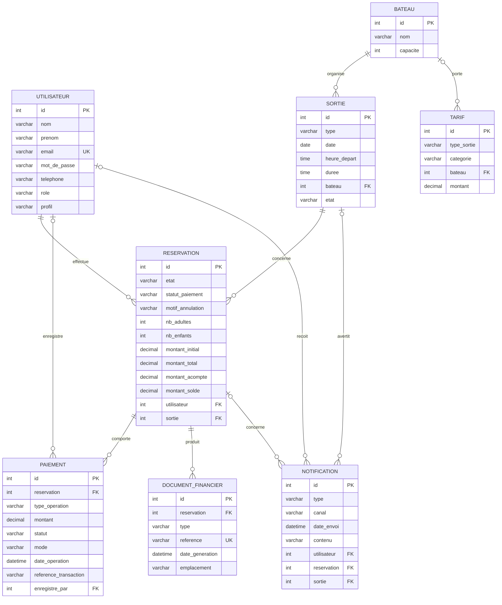

# MCD — Modèle Conceptuel de Données (V3)

| Informations | Détails |
|---|---|
| Projet | TI Baleine App |
| Équipe | 200ping |
| Version | V3 — 20/08/2026 |
| Source | [`Cahier_des_charges_200ping_V3.md`](../cahiers_des_charges/Cahier_des_charges_200ping_V3.md) |
| Schéma logique | [`mcd-V3.dbml`](mcd-V3.dbml) |

## Vue d'ensemble — diagramme des tables

## Décisions de modélisation

- L'état métier de `Reservation` est indépendant du paiement : `reservee`,
  `realisee`, `annulee`.
- Le statut global de paiement est porté par `Reservation.statut_paiement` :
  `en_attente_de_paiement`, `acompte_paye`, `integralement_paye`, `rembourse`.
- `Paiement` est une **opération financière**, pas un paiement unique : une
  réservation peut avoir un acompte, un solde, un complément et un ou plusieurs
  remboursements.
- Le profil `hotel` est porté par `Utilisateur.profil`, sans créer une table
  `Hotel` séparée. Les hôtels restent facturés en fin de mois et ne paient pas
  l'acompte obligatoire.
- Le justificatif d'acompte et la facture finale sont tracés par
  `DocumentFinancier`.

## Entités et attributs principaux

### Utilisateur

`id`, `nom`, `prenom`, `email`, `mot_de_passe`, `telephone`, `role`, `profil`.

`role` vaut `utilisateur`, `employe` ou `administrateur`. `profil` vaut
`particulier` ou `hotel`.

### Bateau

`id`, `nom`, `capacite`.

### Sortie

`id`, `type`, `date`, `heure_depart`, `duree`, `bateau`, `etat`.

`etat` vaut `planifiee`, `avertie` ou `annulee`. L'avertissement reste lié au
créneau et est historisé par `Notification`.

### Reservation

`id`, `etat`, `statut_paiement`, `motif_annulation`, `nb_adultes`,
`nb_enfants`, `montant_initial`, `montant_total`, `montant_acompte`,
`montant_solde`, `utilisateur`, `sortie`.

`etat` vaut `reservee`, `realisee` ou `annulee`. `statut_paiement` vaut
`en_attente_de_paiement`, `acompte_paye`, `integralement_paye` ou `rembourse`.

### Paiement

`id`, `reservation`, `type_operation`, `montant`, `statut`, `mode`,
`date_operation`, `reference_transaction`, `enregistre_par`.

`type_operation` vaut `acompte`, `solde`, `complement` ou `remboursement`.
`mode` vaut `en_ligne`, `sur_place` ou `facturation_hotel`.

### DocumentFinancier

`id`, `reservation`, `type`, `reference`, `date_generation`, `emplacement`.
Le type vaut `justificatif_acompte` ou `facture_finale`.

### Tarif

`id`, `type_sortie`, `categorie`, `bateau`, `montant`.

### Notification

`id`, `type`, `canal`, `date_envoi`, `contenu`, `utilisateur`, `reservation`,
`sortie`.

## Associations et cardinalités

| Association | Cardinalité | Signification |
|---|---|---|
| Utilisateur — Reservation | 1 utilisateur pour 0..n réservations | client ou hôtel propriétaire |
| Sortie — Reservation | 1 sortie pour 0..n réservations | une réservation concerne un créneau |
| Bateau — Sortie | 1 bateau pour 0..n sorties | bateau affecté au créneau |
| Reservation — Paiement | 1 réservation pour 0..n opérations | acompte, solde, complément, remboursement |
| Reservation — DocumentFinancier | 1 réservation pour 0..n documents | justificatif et facture finale |
| Utilisateur — Notification | 1 utilisateur pour 0..n notifications | destinataire éventuel |
| Reservation — Notification | 1 réservation pour 0..n notifications | confirmation, solde, annulation |
| Sortie — Notification | 1 sortie pour 0..n notifications | avertissement/annulation par créneau |
| Bateau — Tarif | 1 bateau pour 0..1 tarif de privatisation | tarif lié au bateau |

## Contraintes métier portées par le modèle

- Acompte : 30 % d'une réservation standard, 50 % d'une privatisation.
- L'acompte particulier est obligatoire et payé en ligne ; son paiement confirme
  la réservation et bloque définitivement les places.
- Le solde est payable en ligne entre 24 h et 12 h avant le départ, puis sur
  place ; seul le patron peut enregistrer un paiement sur place.
- Les réservations hôtel sont facturées en fin de mois, avec remise de 15 %,
  sans acompte obligatoire.
- Une réservation annulée peut conserver plusieurs opérations financières et
  l'historique des sommes déjà payées/remboursées.
- Le blocage temporaire des places reste inchangé avant le paiement de l'acompte.
