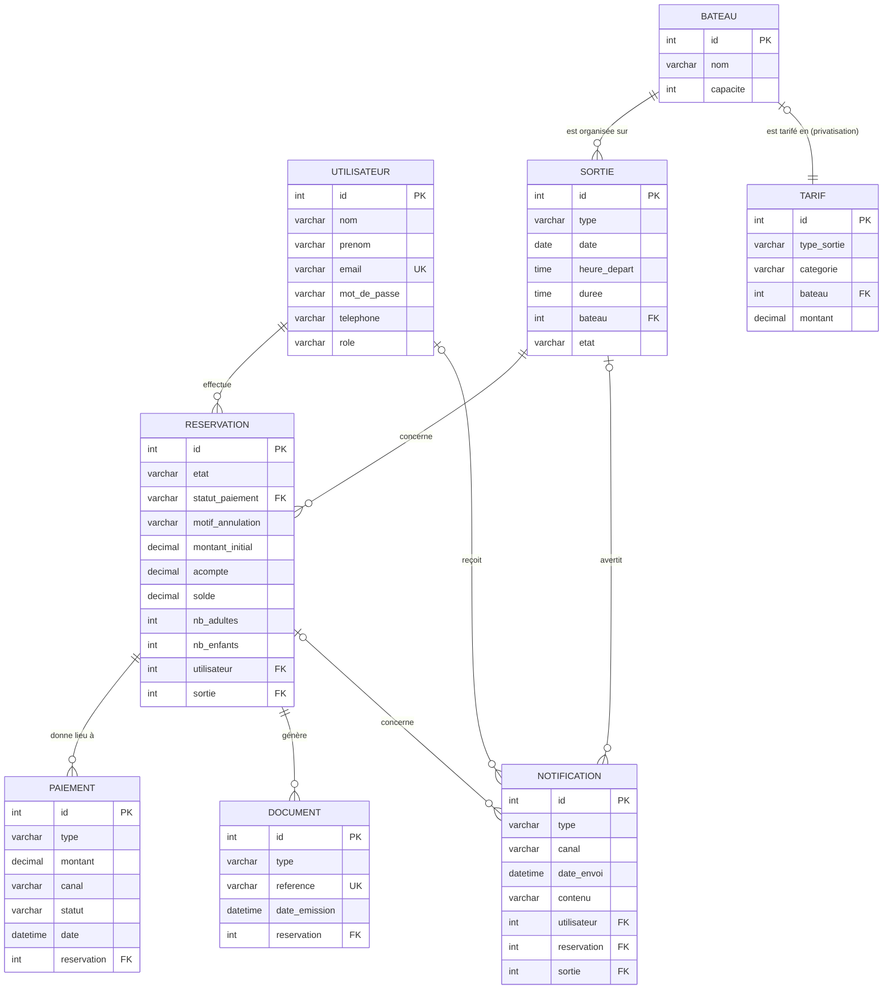

# MCD — Modèle Conceptuel de Données

| Informations            | Détails                                        |
| ----------------------- | ---------------------------------------------- |
| **Projet**              | TI Baleine App                                 |
| **Équipe**              | 200ping                                        |
| **Version**             | v3 (19/08/2026) · v2 (14/08/2026) · v1 (12/08/2026) |
| **Source**              | `Cahier_des_charges_200ping_V5.md` (V5.0), CR-01 → CR-05, impact CR-001 |
| **Date**                | 19/08/2026 (V3) · 14/08/2026 (V2) · 12/08/2026 (V1) |
| **Décision associée**   | `adr/ADR-001-stack.md` (persistance : Doctrine) |

> **Changements V2 → V3 (cahier V5, 19/08/2026) :**
> - `Réservation.état` : `payée` / `annulée` → **`réservée` / `réalisée` /
>   `annulée`** (R-90) ;
> - `Réservation` : ajout d'un **statut de paiement** séparé de l'état
>   (`en_attente_paiement` / `acompte_paye` / `integralement_paye` / `rembourse`)
>   — REQ-025, R-91 ;
> - `Réservation` : ajout de **`montant_initial`**, **`acompte`** (30 % standard /
>   50 % privatisation, jamais recalculé) et **`solde`** — R-81/82/97/98,
>   contraintes 13 et 14 ;
> - `Paiement` : devient une **trace d'opérations** (`acompte` / `solde` /
>   `complement` / `remboursement`), **0..n par réservation** — R-42/52/54,
>   contrainte 15 ;
> - nouvelle entité **`Document`** : justificatif d'acompte + facture finale
>   (REQ-024, R-99).

> **Règle de construction :** ce MCD est issu **uniquement** du cahier des
> charges et, pour les éléments qu'il ne précisait pas, des comptes-rendus
> d'entretien (CR-01 → CR-05) qui en sont la source. Chaque élément cite son
> passage d'origine. Rien n'est ajouté sans source.
>
> **Rôles (décision équipe, corrigée le 12/08/2026) :** trois rôles —
> `utilisateur` (client), `employe` (salarié : consultation seule) et
> `administrateur` (patron : accès complet, dont modification).

---

## 1. Concepts du cahier retenus

| Concept | Justification (cahier) |
|---|---|
| **Utilisateur** | « Inscription », « Connexion (client et entreprise) », « Notification par mail », « Vérification des rôles » |
| **Sortie** (créneau réservable) | « organise des sorties baleine et dauphin et possibilité de privatisation pour d'éventuelles autres types de sorties », « Les clients peuvent réserver leurs créneaux », « Les horaires sont tous les jours de la semaine » |
| **Bateau** | « L'entreprise dispose de deux bateaux de 12 et 24 places » |
| **Réservation** | « Faire une réservation », « Paiement », « Demande d'annulation » ; V5 : états `réservée` / `réalisée` / `annulée` + statut de paiement séparé (R-90/91) |
| **Paiement** | « Paiement en ligne (client) » ; V5 : acompte (30 %/50 %) puis solde, chaque opération tracée (R-42, contrainte 15) |
| **Tarif** | CR-01 §3 : « 65 € adulte 40 € enfant pour baleine, 50 € adulte et 30 € enfant pour dauphin. Privatisation … 600 € ti kap et 1 100 € pour grand bleu » |
| **Notification** | SPEC-BOOK-01 (email de confirmation + SMS au patron), SPEC-CANCEL-02 (avertissement 18 h / annulation ≥ 2 h), SPEC-CANCEL-03 (annulation client après avertissement) — alertes météo et notifications client |
| **Document** | V5 REQ-024 : « Générer un justificatif après le paiement de l'acompte et une facture finale après le paiement intégral » (R-99) |

La **demande d'annulation** et la **modification** ne sont pas des entités : ce
sont des règles portées par la `Réservation` (état + motif + montants), voir §5.

---

## 2. Entités et attributs

### UTILISATEUR

| Attribut | Justification |
|---|---|
| Identifiant | identifiant technique (convention MCD) |
| Nom | décision équipe 12/08/2026 (reprise du MCD LucidChart) |
| Prénom | décision équipe 12/08/2026 (reprise du MCD LucidChart) |
| Email | « Notification par mail », « Connexion » ; CR-01/Q01 (email demandé à la réservation) |
| Mot de passe | « Connexion » — *nullable* dans le MCD LucidChart (mot de passe optionnel, à confirmer) |
| Téléphone | CR-01/Q03 : « Le client laisse son numéro de téléphone lors de la réservation. Appel si annulation. » |
| Rôle | décision équipe (corrigée le 12/08/2026) : `utilisateur` (client) / `employe` (salarié, consultation seule) / `administrateur` (patron, accès complet) — « Vérification des rôles → Accès à la vue concernée (client, salarié ou patron) » |

### SORTIE  *(créneau réservable)*

| Attribut | Justification |
|---|---|
| Identifiant | identifiant technique |
| Type | « sorties baleine et dauphin et possibilité de privatisation pour d'éventuelles autres types de sorties » (baleine, dauphin, privatisation…) ; CR-01/Q01 |
| Date | « Les horaires sont tous les jours de la semaine » ; CR-01/Q23 (tous les jours) |
| Horaire de départ | CR-01 §3 : créneaux 7 h, 10 h et 14 h |
| Durée | CR-01 §3 : 2 h 30 (baleine), 2 h (dauphin) |
| État | SPEC-CANCEL-02 : `planifiée` → `avertie` (avertissement 18 h la veille) → `annulée` (≥ 2 h avant) ; décision **par créneau** (le 7 h peut être annulé, le 10 h maintenu). La date de l'avertissement se déduit des `Notification` de type `avertissement` liées au créneau. |

> Une sortie baleine par créneau (CR-02 §1, CR-01/Q19) ; question ouverte n°1 du
> cahier : les types ne sont **pas** définis en avance en fonction du jour
> (hypothèse retenue). L'annulation météo se fait **par créneau** : le « bulk »
> du patron concerne toutes les sorties du même horaire (SPEC-CANCEL-02).

### BATEAU

| Attribut | Justification |
|---|---|
| Identifiant | identifiant technique |
| Nom | CR-01 §3 : Ti Kap et Grand Bleu |
| Capacité | « deux bateaux de 12 et 24 places » ; CR-01/Q02 : Ti Kap = 12 places, Grand Bleu = 24 places |

### RÉSERVATION

| Attribut | Justification |
|---|---|
| Identifiant | identifiant technique |
| État | R-90 : `réservée`, `réalisée`, `annulée` (le paiement de l'acompte confirme la réservation → `réservée` ; après la prestation → `réalisée` ; annulation → `annulée`) |
| Statut de paiement | R-91, REQ-025 : `en_attente_paiement`, `acompte_paye`, `integralement_paye`, `rembourse` — **séparé de l'état** |
| Motif d'annulation | « Demande d'annulation → Envoi du motif » (renseigné uniquement si annulation) |
| Montant initial | total à la réservation, **conservé** pour le calcul des frais d'annulation et de l'acompte (R-98, contrainte 13) |
| Acompte | 30 % (standard) / 50 % (privatisation) du montant initial ; **jamais recalculé** à la modification (R-81/82/97, contrainte 14) |
| Solde | restant à payer ; augmenté/diminué par les modifications (R-52/54) |
| Nombre d'adultes | CR-01/Q01 : « nombre de personnes (+ nombre d'adultes et d'enfants) » |
| Nombre d'enfants | CR-01/Q01 ; tranche d'âge enfant : 4-11 ans (CR-01/Q14, décision équipe 12/08/2026) |

> Minimum 2 personnes par réservation (CR-01 §3) ; minimum 6 personnes sur le
> bateau, pour les deux bateaux (CR-01/Q22, CR-02 §1) ; réservation bloquée
> 2 h avant le départ (SPEC-BOOK-01 cas 2). L'état (`réservée`/`réalisée`/
> `annulée`) et le `statut de paiement` évoluent indépendamment (REQ-025).

### PAIEMENT  *(opération financière)*

| Attribut | Justification |
|---|---|
| Identifiant | identifiant technique |
| Type | R-42/52/54, contrainte 15 : `acompte`, `solde`, `complement` (ajout de participants), `remboursement` |
| Montant | montant de l'opération (acompte, solde, complément ou remboursement) |
| Canal | R-42/86/88 : `en_ligne` (acompte obligatoirement, solde entre 24 h et 12 h) / `sur_place` (solde enregistré par le patron) |
| Statut | R-92 : `paye`, `impaye` (un complément non réglé reste impayé) |
| Date | trace temporelle de l'opération (REQ-108 : « ne pas être enregistrée deux fois ») |

> Chaque acompte, solde, complément et remboursement est **tracé
> individuellement** (contrainte 15, REQ-108). L'acompte est **toujours en
> ligne** (R-42, R-88) ; le solde se règle en ligne (24 h → 12 h avant) ou sur
> place (enregistré par le patron). Remboursement exécuté **manuellement** par
> le patron (R-49) ; le modèle en assure le calcul et la traçabilité.

### TARIF

| Attribut | Justification |
|---|---|
| Identifiant | identifiant technique |
| Type de sortie | CR-01 §3 : baleine, dauphin, privatisation |
| Catégorie | CR-01/Q14 + décision équipe : adulte (12 ans et +), enfant (4-11 ans) ; sans objet pour la privatisation |
| Bateau | CR-01 §3 : tarif de privatisation par bateau (600 € Ti Kap / 1 100 € Grand Bleu) |
| Montant | CR-01 §3 : 65/40 € baleine, 50/30 € dauphin |

### NOTIFICATION

| Attribut | Justification |
|---|---|
| Identifiant | identifiant technique |
| Type | SPEC-BOOK-01 / SPEC-CANCEL-02/03 : `avertissement`, `annulation`, `confirmation_demande`, `creneau_indisponible` |
| Canal | SPEC-CANCEL-02 (cas 1) : `sms`, `email`, `popup_site` |
| Date d'envoi | SPEC-CANCEL-02 : avertissement la veille à 18 h ; annulation ≥ 2 h avant le départ |
| Contenu | texte du message envoyé (trace) |
| Destinataire | `Utilisateur` concerné (nullable : un pop-up site n'a pas de destinataire individuel) |
| Réservation | réservation concernée (confirmation de prise en charge, annulation, créneau indisponible) |
| Sortie | créneau concerné (avertissement / annulation par créneau) |

> Règles portées : email de confirmation de prise en charge au client + SMS au
> patron à chaque demande (SPEC-BOOK-01) ; avertissement 18 h puis annulation
> ≥ 2 h avant, par créneau (SPEC-CANCEL-02) ; nouveau client réservant après
> l'avertissement : **pas de SMS/mail mais alerte pop-up sur le site**
> (SPEC-CANCEL-02 cas 1) ; hôtel : **pas de notification**, appel direct
> (SPEC-CANCEL-02 cas 2) ; client annulant après avertissement : remboursement
> intégral (SPEC-CANCEL-03).

### DOCUMENT  *(justificatif / facture)*

| Attribut | Justification |
|---|---|
| Identifiant | identifiant technique |
| Type | REQ-024 : `justificatif_acompte` (après l'acompte), `facture_finale` (après le paiement intégral) |
| Référence | référence unique du document (numérotation à valider — question ouverte 19) |
| Date d'émission | date d'émission du document |
| Réservation | réservation concernée |

---

## 3. Associations et cardinalités

| Association | Entité (card.) | Entité (card.) | Signification |
|---|---|---|---|
| **effectue** | UTILISATEUR (0,n) | RÉSERVATION (1,1) | un utilisateur effectue 0..n réservations ; une réservation est effectuée par un seul utilisateur |
| **concerne** | RÉSERVATION (1,1) | SORTIE (0,n) | une réservation concerne une seule sortie (créneau) ; une sortie est concernée par 0..n réservations |
| **donne lieu à** | RÉSERVATION (0,n) | PAIEMENT (1,1) | une réservation donne lieu à 0..n opérations financières ; une opération règle une seule réservation |
| **génère** | RÉSERVATION (0,n) | DOCUMENT (1,1) | une réservation génère 0..n documents ; un document concerne une seule réservation |
| **est organisée sur** | SORTIE (1,1) | BATEAU (0,n) | une sortie est organisée sur un seul bateau ; un bateau accueille 0..n sorties |
| **est tarifé en** | BATEAU (0,1) | TARIF (1,1) | un bateau a au plus un tarif de privatisation ; un tarif de privatisation concerne un seul bateau |
| **reçoit** | UTILISATEUR (0,n) | NOTIFICATION (0,1) | un utilisateur reçoit 0..n notifications ; une notification est adressée à 0..1 utilisateur (null pour pop-up site) |
| **concerne** | RÉSERVATION (0,n) | NOTIFICATION (0,1) | une réservation est concernée par 0..n notifications ; une notification concerne 0..1 réservation |
| **avertit** | SORTIE (0,n) | NOTIFICATION (0,1) | une sortie (créneau) est objet de 0..n notifications ; une notification concerne 0..1 sortie |

### 3.1 Représentation visuelle (Mermaid)

Le schéma ci-dessous se **rend nativement dans l'aperçu Markdown de VS Code**
(`Ctrl+Shift+V` ou bouton « Ouvrir l'aperçu ») — aucune extension à installer.
Il reprend les 8 entités avec leurs clés et les associations listées ci-dessus.

**Lecture des cardinalités (Mermaid) :** `||` = exactement un · `o{` = zéro ou
plusieurs · `o|` = zéro ou un. Par exemple `BATEAU ||--o{ SORTIE` se lit : un
bateau accueille 0..n sorties, une sortie est organisée sur un seul bateau.

---

## 4. Schéma des tables (DBML)

Le modèle de données est décrit en **DBML** dans [`mcd-V3.dbml`](mcd-V3.dbml) : un
fichier texte à ouvrir dans dbdiagram.io ou via l'extension « Database Markup
Language » de VS Code. Les relations y sont exprimées en `ref` avec les
cardinalités (0,n / 1,n / 1,1), cf. aussi les cardinalités Merise du §3.

Tables : `Utilisateur`, `Bateau`, `Sortie`, `Reservation`, `Paiement`, `Tarif`, `Notification`, `Document`.

---

## 5. Règles métier portées par le modèle

Chacune est issue du cahier (V5) :

1. **Cycle de vie d'une réservation** : une réservation passe à l'état
   `réservée` à sa confirmation (paiement de l'acompte pour un client
   particulier), puis `réalisée` après la prestation, ou `annulée` sur demande
   du client ou décision de l'entreprise. (R-90, R-101.)
2. **Séparation état / paiement** : l'état de la réservation et son statut de
   paiement (`en_attente_paiement` / `acompte_paye` / `integralement_paye` /
   `rembourse`) sont deux notions **distinctes**. Le règlement intégral fait
   passer le statut à `integralement_paye` **sans modifier l'état**. (R-91,
   R-101, REQ-025.)
3. **Acompte obligatoire** : pour un client particulier, l'acompte est toujours
   payé en ligne (30 % d'une réservation standard, 50 % d'une privatisation) et
   **confirme** la réservation. Aucune réservation d'un client particulier
   n'existe sans acompte payé. (R-42, R-81/82/83, contrainte 7 à 9.)
4. **Solde différé** : le solde est payé en ligne entre 24 h et 12 h avant le
   départ, puis sur place (enregistré par le patron) ; le client ne peut pas
   embarquer si le solde exigible n'est pas réglé. (R-85 à R-89, R-42.)
5. **Modification sans recalcul** : à la modification, l'acompte déjà payé n'est
   pas recalculé ; l'ajout augmente le solde, la suppression le diminue. Les
   frais d'annulation restent calculés sur le **montant initial**. (R-52/54,
   R-97/98, contraintes 13 et 14.)
6. **Annulation client** : barème existant au-delà de 48 h (100 % > 7 jours,
   75 % entre 7 jours et 48 h) ; à moins de 48 h, frais de 50 % du montant
   initial, sommes déjà payées déduites, complément possible par lien ou sur
   place. (R-08, R-92.)
7. **Annulation entreprise (météo)** : remboursement intégral des sommes déjà
   payées ou report accepté ; si seul l'acompte a été payé, il est remboursé
   intégralement. (R-74, R-94, R-95.)
8. **Absence (no-show)** : aucune somme n'est remboursée ; les sommes encaissées
   sont conservées. (R-93.)
9. **Capacité** : une sortie ne dépasse jamais la capacité du bateau (12 ou 24
   places). (« deux bateaux de 12 et 24 places »)
10. **Accès par rôle** : `utilisateur` (client) réserve et consulte ses propres
    réservations ; `employe` (salarié) consulte sans modifier ;
    `administrateur` (patron) accès complet. (décision équipe 12/08/2026.)
11. **Places** : minimum 2 personnes par réservation, minimum 6 personnes par
    bateau, maximum = capacité du bateau. (CR-01 §3, CR-01/Q02.)
12. **Clientèle hôtel** : l'acompte obligatoire ne s'applique **pas** aux hôtels ;
    facturation en fin de mois avec remise 15 %, statut `en_attente_paiement`
    jusqu'au règlement intégral, 6 places max, pas de privatisation. (R-58,
    R-60, précision §4 du cahier V5.)
13. **Justificatif / facture** : un justificatif est généré après l'acompte, une
    facture finale après le paiement intégral. (R-99, REQ-024.)

---

## 6. Ce qui n'est **pas** modélisé (et pourquoi)

| Élément | Raison |
|---|---|
| Météo en temps réel | exclue du périmètre (« Affichage en temps réel de la météo »). On modélise **l'alerte/annulation** déclenchée manuellement par le patron (qui consulte Météo 974 hors système). |
| Avoir client | exclu du périmètre (le client choisit entre remboursement et report). |
| Remboursement automatique | l'**exécution** du remboursement reste manuelle par le patron (R-49) ; le modèle assure le calcul et la traçabilité (`Paiement.type = remboursement`). |
| Paiement de l'acompte sur place | exclu du périmètre : l'acompte est obligatoirement en ligne. |
| Recouvrement automatique des compléments | un complément non réglé reste `impaye` ; aucune relance automatique. |
| Avoir / référence de transaction | « pas de prestataire fixe » (CR-01 §3) ; ADR-001 prévoit Stripe — référence à préciser. |

---

## 7. Questions sans réponse

### 7.1 Questions ouvertes du cahier V5 (§8) impactant le modèle

| # | Question | Impact sur le modèle |
|---|---|---|
| 17 | Règle d'arrondi lorsque l'acompte comporte une fraction de centime | `acompte`/`solde` en `decimal` ; arrondi monétaire à valider |
| 19 | Format, numérotation et mentions du justificatif et de la facture | `Document.reference` (unique) — format à valider |
| 20 | Échéances 24 h / 12 h calculées à la minute et fuseau horaire | `Paiement.date` + fenêtre de paiement en ligne |
| 22 | Moyens de paiement acceptés pour le solde sur place | `Paiement.canal = sur_place` — moyens non listés |
| 23 | Statut `rembourse` : distinguer partiel / total | le montant remboursé est tracé dans `Paiement`, le statut global reste `rembourse` |

### 7.2 Décisions de l'équipe (12/08/2026)

| # | Sujet | Décision |
|---|---|---|
| 1 | Compte client | **Oui, il y aura un compte client.** |
| 2 | Âge des passagers | Enfant 4 à 11 ans, adulte dès 12 ans ; moins de 4 ans interdits. |
| 3 | Identité du client | Nom et prénom ajoutés à `Utilisateur`. |
| 4 | Mot de passe | Rendu **optionnel** (nullable) — à confirmer. |
| 5 | Clientèle hôtel | `Utilisateur` ordinaire, remise -15 %, 6 places max, facturation fin de mois. |
| 6 | Rôles | `utilisateur` / `employe` (lecture seule) / `administrateur` (accès complet). |
| 7 | Alertes et annulation météo | Avertissement 18 h + annulation ≥ 2 h, par créneau, SMS/mail automatisés, remboursement intégral. |
| 8 | Pas de `type_annulation` | le contexte d'annulation n'est pas porté par un attribut dédié ; les règles s'appuient sur `Sortie.etat` et les `Notification`. |
