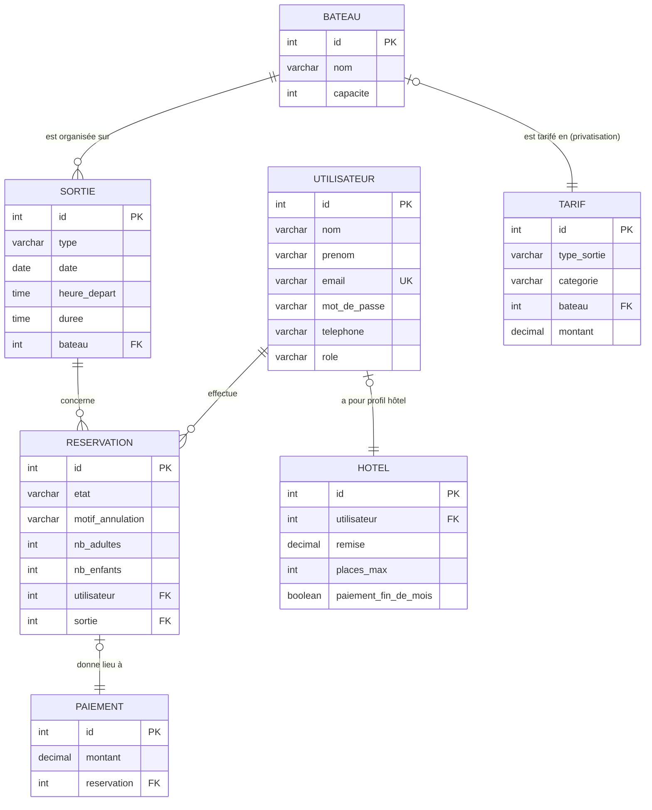

# MLD — Modèle Logique de Données

| Informations | Détails |
|---|---|
| **Projet** | TI Baleine App |
| **Équipe** | 200ping |
| **Source** | Schéma DBML [`docs/mcd/mcd-V1.dbml`](../mcd/mcd-V1.dbml) — rendu lisible en Markdown |
| **MCD associé** | [`docs/mcd/mcd-V1.md`](../mcd/mcd-V1.md) |
| **Date** | 12/08/2026 |
| **Décision associée** | `adr/ADR-001-stack.md` (persistance : Doctrine) |

> Ce document est la **traduction lisible** du schéma DBML : chaque table, ses
> colonnes, ses clés et ses relations. Il n'ajoute rien au modèle — toute
> information provient de `mcd-V1.dbml`, qui cite lui-même le cahier des charges
> et les comptes-rendus (CR-01, CR-02, CR-03).
>
> **Légende :** 🔑 = clé primaire (PK) · 🔗 = clé étrangère (FK) · ⬚ = nullable

---

## 1. Vue d'ensemble — diagramme des relations

Le diagramme ci-dessous se **rend nativement dans l'aperçu Markdown de VS Code**
(`Ctrl+Shift+V` ou bouton « Ouvrir l'aperçu ») — aucune extension à installer.
Il reprend les 7 tables avec leurs clés et les associations du schéma DBML.

**Lecture des cardinalités (Mermaid) :** `||` = exactement un · `o{` = zéro ou
plusieurs · `o|` = zéro ou un. Par exemple `BATEAU ||--o{ SORTIE` se lit : un
bateau accueille 0..n sorties, une sortie est organisée sur un seul bateau.

---

## 2. Tables détaillées

7 tables : `Utilisateur`, `Bateau`, `Sortie`, `Reservation`, `Paiement`, `Tarif`, `Hotel`.

### 2.1 Utilisateur

Compte client / salarié / administrateur.

| Colonne | Type | Contraintes | Commentaire |
|---|---|---|---|
| 🔑 `id` | `int` | auto-incrément | identifiant technique |
| `nom` | `varchar` | | décision équipe 12/08/2026 (MCD LucidChart) |
| `prenom` | `varchar` | | décision équipe 12/08/2026 (MCD LucidChart) |
| `email` | `varchar` | `NOT NULL`, `UNIQUE` | CR-01/Q01 — email demandé à la réservation |
| `mot_de_passe` | `varchar` | ⬚ | nullable (MCD LucidChart) — mot de passe optionnel |
| `telephone` | `varchar` | ⬚ | CR-01/Q03 — laissé à la réservation, appel si annulation |
| `role` | `varchar` | `NOT NULL`, défaut `'utilisateur'` | `utilisateur` (client) \| `employe` (lecture seule) \| `administrateur` (accès complet) |

### 2.2 Bateau

| Colonne | Type | Contraintes | Commentaire |
|---|---|---|---|
| 🔑 `id` | `int` | auto-incrément | identifiant technique |
| `nom` | `varchar` | `NOT NULL` | CR-01 §3 — Ti Kap, Grand Bleu |
| `capacite` | `int` | `NOT NULL` | CR-01/Q02 — 12 ou 24 places |

### 2.3 Sortie  *(créneau réservable)*

| Colonne | Type | Contraintes | Commentaire |
|---|---|---|---|
| 🔑 `id` | `int` | auto-incrément | identifiant technique |
| `type` | `varchar` | `NOT NULL` | CR-01/Q01 — `baleine` \| `dauphin` \| `privatisation` |
| `date` | `date` | `NOT NULL` | CR-01/Q23 — tous les jours |
| `heure_depart` | `time` | `NOT NULL` | CR-01 §3 — créneaux 7 h / 10 h / 14 h |
| `duree` | `time` | `NOT NULL` | CR-01 §3 — 2 h 30 baleine, 2 h dauphin |
| 🔗 `bateau` | `int` | `NOT NULL` → `Bateau.id` | une sortie est organisée sur un seul bateau (1,1) |

### 2.4 Reservation

| Colonne | Type | Contraintes | Commentaire |
|---|---|---|---|
| 🔑 `id` | `int` | auto-incrément | identifiant technique |
| `etat` | `varchar` | `NOT NULL`, défaut `'en_attente'` | `en_attente` \| `confirmée` \| `refusée` \| `annulée` |
| `motif_annulation` | `varchar` | ⬚ | renseigné si demande d'annulation (envoi du motif) |
| `nb_adultes` | `int` | `NOT NULL` | CR-01/Q01 |
| `nb_enfants` | `int` | `NOT NULL` | CR-01/Q01 — enfant : 4 à 11 ans |
| 🔗 `utilisateur` | `int` | `NOT NULL` → `Utilisateur.id` | une réservation = un utilisateur (1,1) |
| 🔗 `sortie` | `int` | `NOT NULL` → `Sortie.id` | une réservation = une sortie (1,1) |

> Règles portées par la table : min 2 personnes/réservation ; min 6
> personnes/bateau ; modification possible uniquement si `etat = en_attente`.

### 2.5 Paiement

| Colonne | Type | Contraintes | Commentaire |
|---|---|---|---|
| 🔑 `id` | `int` | auto-incrément | identifiant technique |
| `montant` | `decimal` | `NOT NULL` | calculé depuis `Tarif` (CR-01 §3) |
| 🔗 `reservation` | `int` | `UNIQUE` → `Reservation.id` | une réservation donne lieu à 0..1 paiement |

> Statut / référence de la transaction : à préciser (pas de prestataire fixe,
> ADR-001 : Stripe).

### 2.6 Tarif

| Colonne | Type | Contraintes | Commentaire |
|---|---|---|---|
| 🔑 `id` | `int` | auto-incrément | identifiant technique |
| `type_sortie` | `varchar` | `NOT NULL` | `baleine` \| `dauphin` \| `privatisation` |
| `categorie` | `varchar` | ⬚ | `adulte` \| `enfant` (null pour privatisation) |
| 🔗 `bateau` | `int` | → `Bateau.id` | tarif privatisation lié au bateau (600 Ti Kap / 1100 Grand Bleu) |
| `montant` | `decimal` | `NOT NULL` | CR-01 §3 : 65/40 baleine, 50/30 dauphin |

### 2.7 Hotel

| Colonne | Type | Contraintes | Commentaire |
|---|---|---|---|
| 🔑 `id` | `int` | auto-incrément | identifiant technique |
| 🔗 `utilisateur` | `int` | `NOT NULL`, `UNIQUE` → `Utilisateur.id` | 1 compte utilisateur = 0..1 hôtel (CR-03) |
| `remise` | `decimal` | `NOT NULL`, défaut `0.15` | remise -15 % sur le total (CR-03 §3) |
| `places_max` | `int` | `NOT NULL`, défaut `6` | 6 places max par créneau (CR-03 contrainte 02) |
| `paiement_fin_de_mois` | `boolean` | `NOT NULL`, défaut `true` | paiement en fin de mois (CR-03 §3) |

---

## 3. Relations et cardinalités (Merise)

| Association | Entité (card.) | Entité (card.) | Signification |
|---|---|---|---|
| **effectue** | `Utilisateur` (0,n) | `Reservation` (1,1) | un utilisateur effectue 0..n réservations ; une réservation est effectuée par un seul utilisateur |
| **concerne** | `Sortie` (0,n) | `Reservation` (1,1) | une sortie est concernée par 0..n réservations ; une réservation concerne une seule sortie |
| **est organisée sur** | `Bateau` (0,n) | `Sortie` (1,1) | un bateau accueille 0..n sorties ; une sortie est organisée sur un seul bateau |
| **donne lieu à** | `Reservation` (0,1) | `Paiement` (1,1) | une réservation donne lieu à 0..1 paiement ; un paiement règle une seule réservation |
| **est tarifé en** | `Bateau` (0,1) | `Tarif` (1,1) | un bateau a au plus un tarif de privatisation ; un tarif de privatisation concerne un seul bateau |
| **a pour profil hôtel** | `Utilisateur` (0,1) | `Hotel` (1,1) | un utilisateur a au plus un profil hôtel ; un hôtel correspond à un seul compte utilisateur |

---

## 4. Vue des clés étrangères

| Clé étrangère | Table (colonne) | Référence | Cardinalité |
|---|---|---|---|
| FK | `Sortie.bateau` | `Bateau.id` | (1,1) |
| FK | `Reservation.utilisateur` | `Utilisateur.id` | (1,1) |
| FK | `Reservation.sortie` | `Sortie.id` | (1,1) |
| FK | `Paiement.reservation` | `Reservation.id` | (0,1) — `UNIQUE` |
| FK | `Tarif.bateau` | `Bateau.id` | (0,1) — privatisation uniquement |
| FK | `Hotel.utilisateur` | `Utilisateur.id` | (0,1) — `UNIQUE` |
