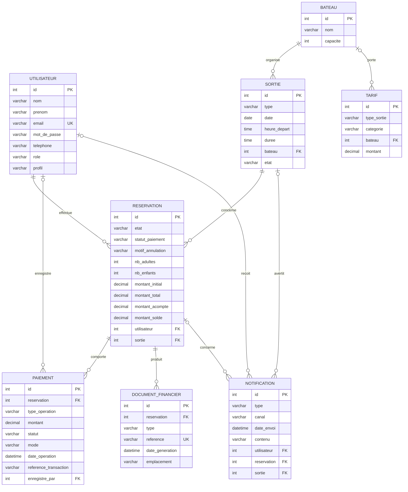

# MLD — Modèle Logique de Données (V3)

| Informations | Détails |
|---|---|
| Projet | TI Baleine App |
| Équipe | 200ping |
| Version | V3 — 20/08/2026 |
| Source | [`Cahier_des_charges_200ping_V3.md`](../cahiers_des_charges/Cahier_des_charges_200ping_V3.md) |
| MCD associé | [`mcd-V3.dbml`](../mcd/mcd-V3.dbml) |

## Vue d'ensemble — diagramme des tables

> V3 sépare l'état métier de la réservation du statut global de paiement. Une
> réservation peut donner lieu à plusieurs opérations financières : acompte,
> solde, complément et remboursement.

## Tables

### Utilisateur

| Colonne | Type | Contraintes | Commentaire |
|---|---|---|---|
| id | int | PK, auto-incrément | identifiant |
| nom | varchar | | identité client |
| prenom | varchar | | identité client |
| email | varchar | NOT NULL, UNIQUE | compte |
| mot_de_passe | varchar | nullable | mot de passe optionnel |
| telephone | varchar | nullable | contact |
| role | varchar | NOT NULL, défaut `utilisateur` | utilisateur, employe, administrateur |
| profil | varchar | NOT NULL, défaut `particulier` | particulier ou hotel |

### Bateau

| Colonne | Type | Contraintes | Commentaire |
|---|---|---|---|
| id | int | PK, auto-incrément | identifiant |
| nom | varchar | NOT NULL | Ti Kap, Grand Bleu |
| capacite | int | NOT NULL | capacité du bateau |

### Sortie

| Colonne | Type | Contraintes | Commentaire |
|---|---|---|---|
| id | int | PK, auto-incrément | identifiant |
| type | varchar | NOT NULL | baleine, dauphin, privatisation |
| date | date | NOT NULL | jour de sortie |
| heure_depart | time | NOT NULL | créneau |
| duree | time | NOT NULL | durée |
| bateau | int | NOT NULL, FK Bateau.id | bateau affecté |
| etat | varchar | NOT NULL, défaut `planifiee` | planifiee, avertie, annulee |

### Reservation

| Colonne | Type | Contraintes | Commentaire |
|---|---|---|---|
| id | int | PK, auto-incrément | identifiant |
| etat | varchar | NOT NULL, défaut `reservee` | reservee, realisee, annulee |
| statut_paiement | varchar | NOT NULL, défaut `en_attente_de_paiement` | en_attente_de_paiement, acompte_paye, integralement_paye, rembourse |
| motif_annulation | varchar | nullable | motif fourni par le client |
| nb_adultes | int | NOT NULL | adultes |
| nb_enfants | int | NOT NULL | enfants 4-11 ans |
| montant_initial | decimal | NOT NULL | base des frais d'annulation, R-98 |
| montant_total | decimal | NOT NULL | total initial/courant |
| montant_acompte | decimal | NOT NULL | 30 % standard, 50 % privatisation |
| montant_solde | decimal | NOT NULL | reste à payer |
| utilisateur | int | NOT NULL, FK Utilisateur.id | client ou hôtel |
| sortie | int | NOT NULL, FK Sortie.id | créneau |

**Règles de réservation/paiement :** l'acompte particulier est obligatoire et
payé en ligne ; le blocage temporaire des places reste inchangé ; le solde est
payable en ligne entre 24 h et 12 h puis sur place ; le patron enregistre le
paiement sur place ; une réservation d'hôtel conserve la facturation mensuelle
et le statut `en_attente_de_paiement`.

### Paiement

| Colonne | Type | Contraintes | Commentaire |
|---|---|---|---|
| id | int | PK, auto-incrément | identifiant |
| reservation | int | NOT NULL, FK Reservation.id | plusieurs paiements possibles |
| type_operation | varchar | NOT NULL | acompte, solde, complement, remboursement |
| montant | decimal | NOT NULL | montant de l'opération |
| statut | varchar | NOT NULL | en_attente, paye, rembourse |
| mode | varchar | NOT NULL | en_ligne, sur_place, facturation_hotel |
| date_operation | datetime | NOT NULL | historique |
| reference_transaction | varchar | nullable | référence du prestataire |
| enregistre_par | int | nullable, FK Utilisateur.id | patron pour le paiement sur place |

### DocumentFinancier

| Colonne | Type | Contraintes | Commentaire |
|---|---|---|---|
| id | int | PK, auto-incrément | identifiant |
| reservation | int | NOT NULL, FK Reservation.id | réservation concernée |
| type | varchar | NOT NULL | justificatif_acompte, facture_finale |
| reference | varchar | NOT NULL, UNIQUE | référence du document |
| date_generation | datetime | NOT NULL | génération |
| emplacement | varchar | nullable | stockage du document |

### Tarif

| Colonne | Type | Contraintes | Commentaire |
|---|---|---|---|
| id | int | PK, auto-incrément | identifiant |
| type_sortie | varchar | NOT NULL | type de sortie |
| categorie | varchar | nullable | adulte, enfant, null pour privatisation |
| bateau | int | nullable, FK Bateau.id | tarif privatisation |
| montant | decimal | NOT NULL | montant |

### Notification

| Colonne | Type | Contraintes | Commentaire |
|---|---|---|---|
| id | int | PK, auto-incrément | identifiant |
| type | varchar | NOT NULL | confirmation_reservation, avertissement, annulation, solde |
| canal | varchar | NOT NULL | sms, email, popup_site, espace_admin |
| date_envoi | datetime | NOT NULL | horodatage |
| contenu | varchar | nullable | contenu envoyé |
| utilisateur | int | nullable, FK Utilisateur.id | destinataire |
| reservation | int | nullable, FK Reservation.id | réservation concernée |
| sortie | int | nullable, FK Sortie.id | créneau concerné |

## Relations

- `Utilisateur (0,n)` effectue `Reservation (1,1)`.
- `Sortie (0,n)` concerne `Reservation (1,1)`.
- `Bateau (0,n)` organise `Sortie (1,1)`.
- `Reservation (0,n)` possède `Paiement (1,1)`.
- `Reservation (0,n)` produit `DocumentFinancier (1,1)`.
- `Utilisateur (0,n)` reçoit `Notification (0,1)`.
- `Reservation (0,n)` concerne `Notification (0,1)`.
- `Sortie (0,n)` avertit `Notification (0,1)`.
