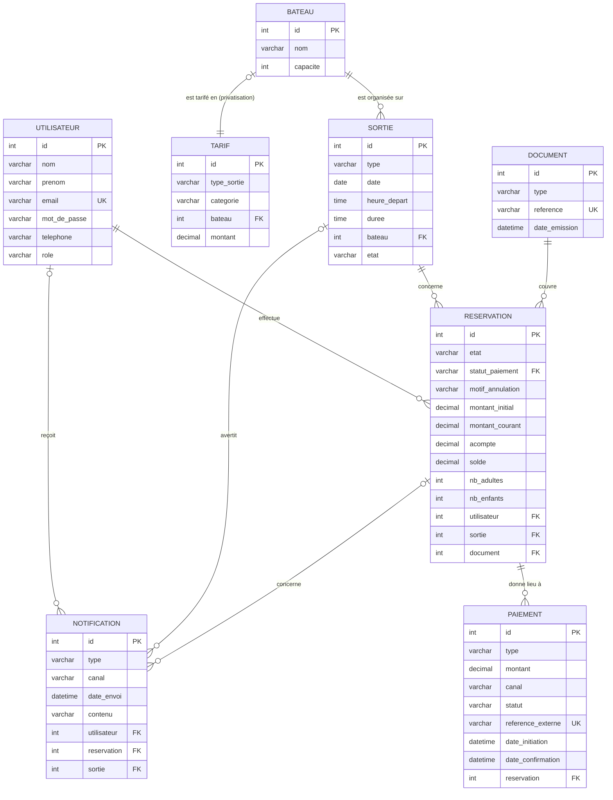

# MLD — Modèle Logique de Données (V3)

| Informations | Détails |
|---|---|
| **Projet** | TI Baleine App |
| **Équipe** | 200ping |
| **Version** | v3 (19/08/2026) · v2 (14/08/2026) · v1 (12/08/2026) |
| **Source** | Schéma DBML [`docs/mcd/mcd-V3.dbml`](../mcd/mcd-V3.dbml) — rendu lisible en Markdown |
| **MCD associé** | [`docs/mcd/mcd-V3.md`](../mcd/mcd-V3.md) |
| **Décision associée** | `adr/ADR-001-stack.md` (persistance : Doctrine) |

> Ce document est la **traduction lisible** du schéma DBML : chaque table, ses
> colonnes, ses clés et ses relations. Il n'ajoute rien au modèle — toute
> information provient de `mcd-V3.dbml`, qui cite lui-même le cahier des
> charges V5.0, les comptes-rendus (CR-01 → CR-05) et l'analyse d'impact CR-001.
>
> **Changements V2 → V3 :** `Reservation.etat` (`réservée` / `réalisée` /
> `annulée`) · ajout de `Reservation.statut_paiement` (séparé de l'état) · ajout
> de `montant_initial`, `acompte`, `solde` sur `Reservation` · `Paiement` en
> opérations multiples (acompte / solde / complément / remboursement) · ajout de
> la table `Document` (justificatif d'acompte + facture finale).
>
> **Compléments V3 (20/08/2026, audit croisé multi-agents) :** ajout de
> `hotel` dans `Utilisateur.role` · ajout de `Reservation.montant_courant` ·
> ajout de `Paiement.reference_externe`/`date_initiation`/`date_confirmation`
> et élargissement de `Paiement.statut` (idempotence) · `Document` détaché de
> `Reservation` — relation inversée via `Reservation.document` (facture hôtel
> mensuelle multi-réservations, type `facture_hotel_mensuelle`).
>
> **Légende :** 🔑 = clé primaire (PK) · 🔗 = clé étrangère (FK) · ⬚ = nullable

---

## 1. Vue d'ensemble — diagramme des relations

Le diagramme ci-dessous se **rend nativement dans l'aperçu Markdown de VS Code**
(`Ctrl+Shift+V` ou bouton « Ouvrir l'aperçu ») — aucune extension à installer.
Il reprend les 8 tables avec leurs clés et les associations du schéma DBML V3.

**Lecture des cardinalités (Mermaid) :** `||` = exactement un · `o{` = zéro ou
plusieurs · `o|` = zéro ou un. Par exemple `RESERVATION ||--o{ PAIEMENT` se lit :
une réservation donne lieu à 0..n paiements (acompte, solde, complément,
remboursement), un paiement règle une seule réservation. `DOCUMENT ||--o{
RESERVATION` se lit : un document (ex. facture hôtel mensuelle) peut couvrir
0..n réservations.

---

## 2. Tables détaillées

8 tables : `Utilisateur`, `Bateau`, `Sortie`, `Reservation`, `Paiement`, `Tarif`, `Notification`, `Document`.

### 2.1 Utilisateur

Compte client / hôtel partenaire / salarié / administrateur.

| Colonne | Type | Contraintes | Commentaire |
|---|---|---|---|
| 🔑 `id` | `int` | auto-incrément | identifiant technique |
| `nom` | `varchar` | | décision équipe 12/08/2026 (MCD LucidChart) |
| `prenom` | `varchar` | | décision équipe 12/08/2026 (MCD LucidChart) |
| `email` | `varchar` | `NOT NULL`, `UNIQUE` | CR-01/Q01 — email demandé à la réservation |
| `mot_de_passe` | `varchar` | ⬚ | nullable (MCD LucidChart) — mot de passe optionnel |
| `telephone` | `varchar` | ⬚ | CR-01/Q03 — laissé à la réservation, appel si annulation |
| `role` | `varchar` | `NOT NULL`, défaut `'utilisateur'` | `utilisateur` (client) \| `hotel` (client pro — 6 places max, pas d'acompte, facturation fin de mois, remise 15 %) \| `employe` (lecture seule) \| `administrateur` (accès complet) |

### 2.2 Bateau

| Colonne | Type | Contraintes | Commentaire |
|---|---|---|---|
| 🔑 `id` | `int` | auto-incrément | identifiant technique |
| `nom` | `varchar` | `NOT NULL` | CR-01 §3 — Ti Kap, Grand Bleu |
| `capacite` | `int` | `NOT NULL` | CR-01/Q02 — 12 ou 24 places |

### 2.3 Sortie  *(créneau réservable)*

| Colonne | Type | Contraintes | Commentaire |
|---|---|---|---|
| 🔑 `id` | `int` | auto-incrément | identifiant technique |
| `type` | `varchar` | `NOT NULL` | CR-01/Q01 — `baleine` \| `dauphin` \| `privatisation` |
| `date` | `date` | `NOT NULL` | CR-01/Q23 — tous les jours |
| `heure_depart` | `time` | `NOT NULL` | CR-01 §3 — créneaux 7 h / 10 h / 14 h |
| `duree` | `time` | `NOT NULL` | CR-01 §3 — 2 h 30 baleine, 2 h dauphin |
| 🔗 `bateau` | `int` | `NOT NULL` → `Bateau.id` | une sortie est organisée sur un seul bateau (1,1) |
| `etat` | `varchar` | `NOT NULL`, défaut `'planifiée'` | SPEC-CANCEL-02 — `planifiée` \| `avertie` \| `annulée` (par créneau) ; la date d'avertissement se déduit des `Notification` (type `avertissement`) |

### 2.4 Reservation

| Colonne | Type | Contraintes | Commentaire |
|---|---|---|---|
| 🔑 `id` | `int` | auto-incrément | identifiant technique |
| `etat` | `varchar` | `NOT NULL`, défaut `'réservée'` | R-90 — `réservée` \| `réalisée` \| `annulée` |
| `statut_paiement` | `varchar` | `NOT NULL`, défaut `'en_attente_paiement'` | R-91, REQ-025 — `en_attente_paiement` \| `acompte_paye` \| `integralement_paye` \| `rembourse` (séparé de l'état) |
| `motif_annulation` | `varchar` | ⬚ | renseigné si demande d'annulation (envoi du motif) |
| `montant_initial` | `decimal` | `NOT NULL` | total à la réservation, base des frais d'annulation et de l'acompte (R-98, contrainte 13) — jamais modifié |
| `montant_courant` | `decimal` | `NOT NULL` | prix courant après modification de participants ; distinct du montant initial (R-52/54/97, `impact-CR-001.md`) |
| `acompte` | `decimal` | `NOT NULL` | 30 % (standard) / 50 % (privatisation) du `montant_initial` ; jamais recalculé à la modification (R-81/82/97, contrainte 14) |
| `solde` | `decimal` | `NOT NULL` | = `montant_courant` − `acompte` − sommes déjà réglées ; ajusté par les modifications (R-52/54) |
| `nb_adultes` | `int` | `NOT NULL` | CR-01/Q01 |
| `nb_enfants` | `int` | `NOT NULL` | CR-01/Q01 — enfant : 4 à 11 ans |
| 🔗 `utilisateur` | `int` | `NOT NULL` → `Utilisateur.id` | une réservation = un utilisateur (1,1) |
| 🔗 `sortie` | `int` | `NOT NULL` → `Sortie.id` | une réservation = une sortie (1,1) |
| 🔗 `document` | `int` | ⬚ → `Document.id` | 0..n réservations peuvent partager un même document (facture hôtel mensuelle) |

> Règles portées : min 2 personnes/réservation ; min 6 personnes/bateau ;
> réservation bloquée 2 h avant le départ (SPEC-BOOK-01 cas 2). L'état
> (`réservée`/`réalisée`/`annulée`) décrit le cycle de vie de la réservation ;
> le `statut_paiement` décrit seul l'avancement financier (REQ-025, R-101).

### 2.5 Paiement  *(opération financière)*

| Colonne | Type | Contraintes | Commentaire |
|---|---|---|---|
| 🔑 `id` | `int` | auto-incrément | identifiant technique |
| `type` | `varchar` | `NOT NULL` | `acompte` \| `solde` \| `complement` \| `remboursement` (R-42/52/54, contrainte 15) |
| `montant` | `decimal` | `NOT NULL` | montant de l'opération |
| `canal` | `varchar` | `NOT NULL` | `en_ligne` \| `sur_place` (R-42/86/88) |
| `statut` | `varchar` | `NOT NULL`, défaut `'en_attente'` | `en_attente` \| `paye` \| `echoue` \| `impaye` (complément non réglé, R-92) |
| `reference_externe` | `varchar` | ⬚, `UNIQUE` | id de transaction PSP (Stripe) ou de webhook — déduplication idempotente (REQ-108) |
| `date_initiation` | `datetime` | `NOT NULL` | moment du déclenchement du paiement |
| `date_confirmation` | `datetime` | ⬚ | remplie à la confirmation (webhook ou enregistrement patron) |
| 🔗 `reservation` | `int` | `NOT NULL` → `Reservation.id` | une réservation donne lieu à 0..n opérations financières |

> Une réservation est réglée en plusieurs opérations distinctes (acompte, solde,
> complément d'ajout de participants, remboursement), chacune tracée
> individuellement (contrainte 15, REQ-108). L'acompte est toujours `en_ligne` ;
> le solde et le complément peuvent être `en_ligne` ou `sur_place` (R-42, R-88).
> `reference_externe` empêche qu'un webhook reçu plusieurs fois (ou après
> l'expiration du lien de solde) ne crée deux opérations pour le même paiement ;
> avant d'enregistrer un paiement sur place, vérifier qu'aucun paiement en
> ligne n'est déjà `paye` ou `en_attente` pour la même réservation.

### 2.6 Tarif

| Colonne | Type | Contraintes | Commentaire |
|---|---|---|---|
| 🔑 `id` | `int` | auto-incrément | identifiant technique |
| `type_sortie` | `varchar` | `NOT NULL` | `baleine` \| `dauphin` \| `privatisation` |
| `categorie` | `varchar` | ⬚ | `adulte` \| `enfant` (null pour privatisation) |
| 🔗 `bateau` | `int` | → `Bateau.id` | tarif privatisation lié au bateau (600 Ti Kap / 1 100 Grand Bleu) |
| `montant` | `decimal` | `NOT NULL` | CR-01 §3 : 65/40 baleine, 50/30 dauphin |

### 2.7 Notification

| Colonne | Type | Contraintes | Commentaire |
|---|---|---|---|
| 🔑 `id` | `int` | auto-incrément | identifiant technique |
| `type` | `varchar` | `NOT NULL` | `avertissement` \| `annulation` \| `confirmation_demande` \| `creneau_indisponible` |
| `canal` | `varchar` | `NOT NULL` | `sms` \| `email` \| `popup_site` |
| `date_envoi` | `datetime` | `NOT NULL` | avertissement 18 h la veille ; annulation ≥ 2 h avant |
| `contenu` | `varchar` | ⬚ | texte du message envoyé (trace) |
| 🔗 `utilisateur` | `int` | ⬚ → `Utilisateur.id` | destinataire (null : pop-up site) |
| 🔗 `reservation` | `int` | ⬚ → `Reservation.id` | réservation concernée |
| 🔗 `sortie` | `int` | ⬚ → `Sortie.id` | créneau concerné (avertissement / annulation) |

> Règles : email de confirmation au client + SMS au patron (SPEC-BOOK-01) ;
> avertissement puis annulation par créneau (SPEC-CANCEL-02) ; nouveau client
> après avertissement : pop-up site, pas de SMS/mail (SPEC-CANCEL-02 cas 1) ;
> hôtel : pas de notification, appel direct (SPEC-CANCEL-02 cas 2).

### 2.8 Document  *(justificatif / facture)*

| Colonne | Type | Contraintes | Commentaire |
|---|---|---|---|
| 🔑 `id` | `int` | auto-incrément | identifiant technique |
| `type` | `varchar` | `NOT NULL` | `justificatif_acompte` \| `facture_finale` \| `facture_hotel_mensuelle` (REQ-024, REQ-013) |
| `reference` | `varchar` | `NOT NULL`, `UNIQUE` | référence unique du document |
| `date_emission` | `datetime` | `NOT NULL` | date d'émission |

> Pas de FK vers `Reservation` ici : la relation est portée par
> `Reservation.document`, pour permettre à plusieurs réservations de partager
> un même document (facture hôtel mensuelle). Un justificatif d'acompte ou une
> facture finale reste rattaché à une seule réservation en pratique. Un
> justificatif est généré après le paiement de l'acompte ; une facture finale
> après le paiement intégral (R-99, REQ-024). L'**émission** d'une facture ne
> change pas le statut de paiement des réservations couvertes — seul le
> **règlement** enregistré par le patron les fait passer à
> `integralement_paye` (R-101). Format et numérotation : à valider (question
> ouverte 19 du cahier V5).

---

## 3. Relations et cardinalités (Merise)

| Association | Entité (card.) | Entité (card.) | Signification |
|---|---|---|---|
| **effectue** | `Utilisateur` (0,n) | `Reservation` (1,1) | un utilisateur effectue 0..n réservations ; une réservation est effectuée par un seul utilisateur |
| **concerne** | `Sortie` (0,n) | `Reservation` (1,1) | une sortie est concernée par 0..n réservations ; une réservation concerne une seule sortie |
| **est organisée sur** | `Bateau` (0,n) | `Sortie` (1,1) | un bateau accueille 0..n sorties ; une sortie est organisée sur un seul bateau |
| **donne lieu à** | `Reservation` (0,n) | `Paiement` (1,1) | une réservation donne lieu à 0..n opérations financières ; une opération règle une seule réservation |
| **est couverte par** | `Reservation` (0,n) | `Document` (0,1) | 0..n réservations peuvent être couvertes par un même document (facture hôtel mensuelle) ; une réservation a au plus un document |
| **est tarifé en** | `Bateau` (0,1) | `Tarif` (1,1) | un bateau a au plus un tarif de privatisation ; un tarif de privatisation concerne un seul bateau |
| **reçoit** | `Utilisateur` (0,n) | `Notification` (0,1) | un utilisateur reçoit 0..n notifications ; une notification est adressée à 0..1 utilisateur (null pour pop-up site) |
| **concerne** | `Reservation` (0,n) | `Notification` (0,1) | une réservation est concernée par 0..n notifications ; une notification concerne 0..1 réservation |
| **avertit** | `Sortie` (0,n) | `Notification` (0,1) | une sortie est objet de 0..n notifications ; une notification concerne 0..1 sortie |

---

## 4. Vue des clés étrangères

| Clé étrangère | Table (colonne) | Référence | Cardinalité |
|---|---|---|---|
| FK | `Sortie.bateau` | `Bateau.id` | (1,1) |
| FK | `Reservation.utilisateur` | `Utilisateur.id` | (1,1) |
| FK | `Reservation.sortie` | `Sortie.id` | (1,1) |
| FK | `Paiement.reservation` | `Reservation.id` | (0,n) — opérations multiples |
| FK | `Reservation.document` | `Document.id` | (0,n) — plusieurs réservations peuvent partager un document (facture hôtel mensuelle) |
| FK | `Tarif.bateau` | `Bateau.id` | (0,1) — privatisation uniquement |
| FK | `Notification.utilisateur` | `Utilisateur.id` | (0,1) — nullable (pop-up site) |
| FK | `Notification.reservation` | `Reservation.id` | (0,1) |
| FK | `Notification.sortie` | `Sortie.id` | (0,1) |
