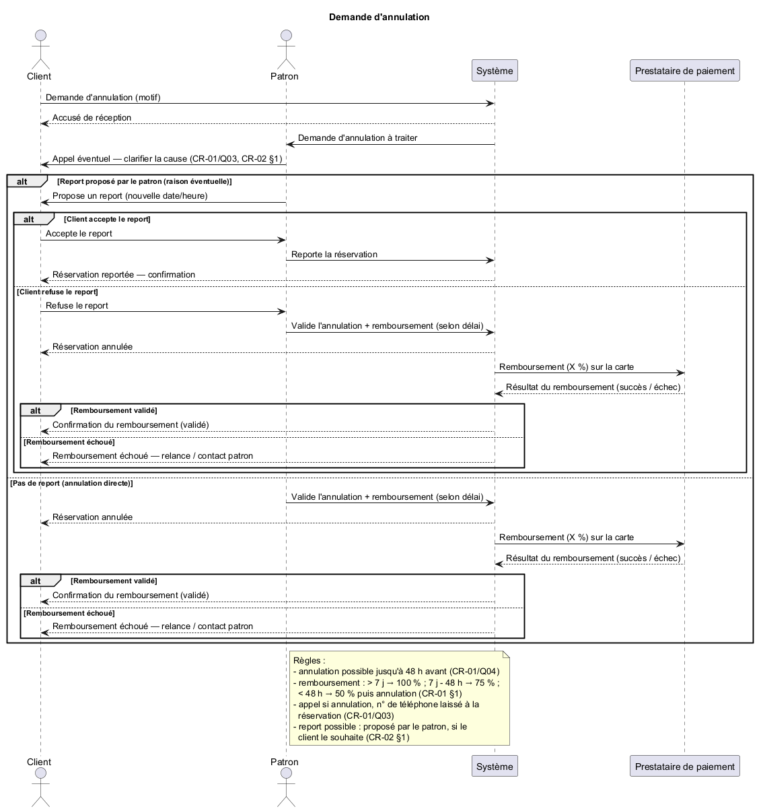
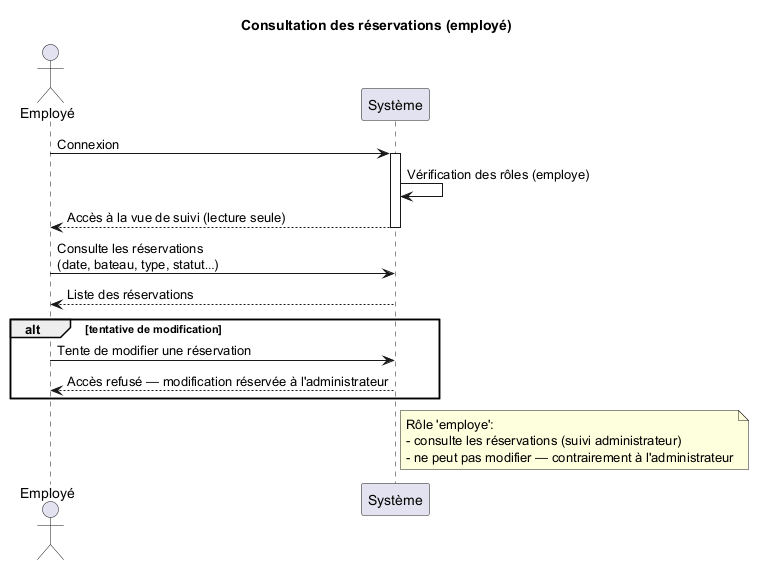
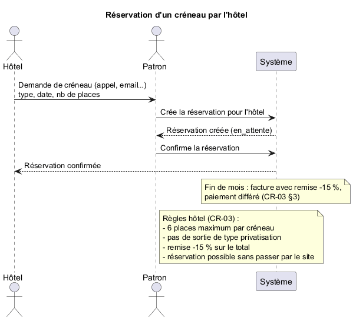
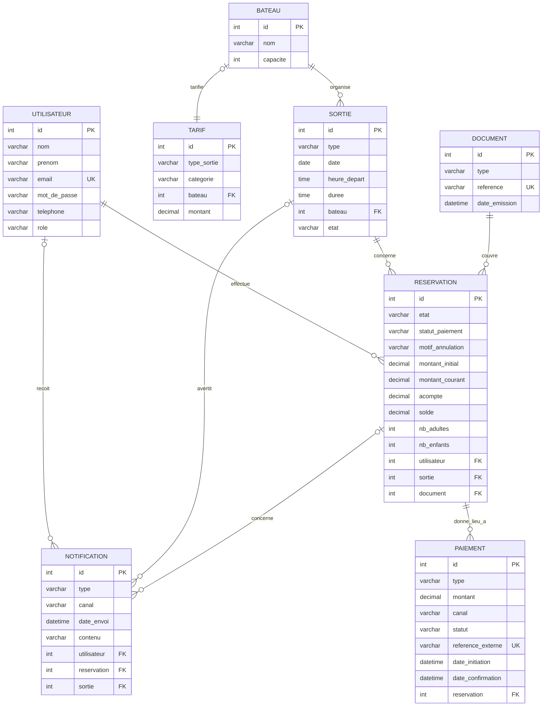
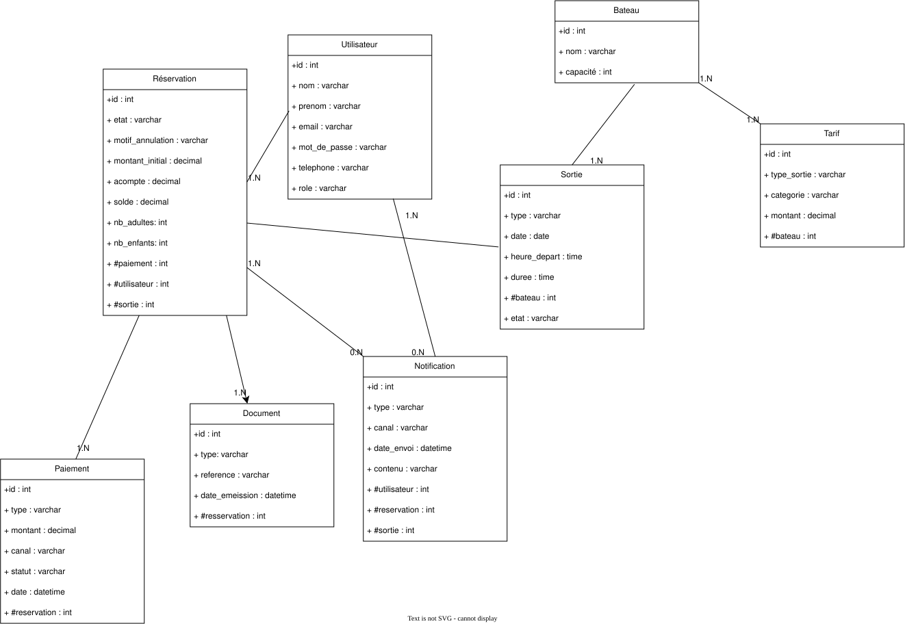
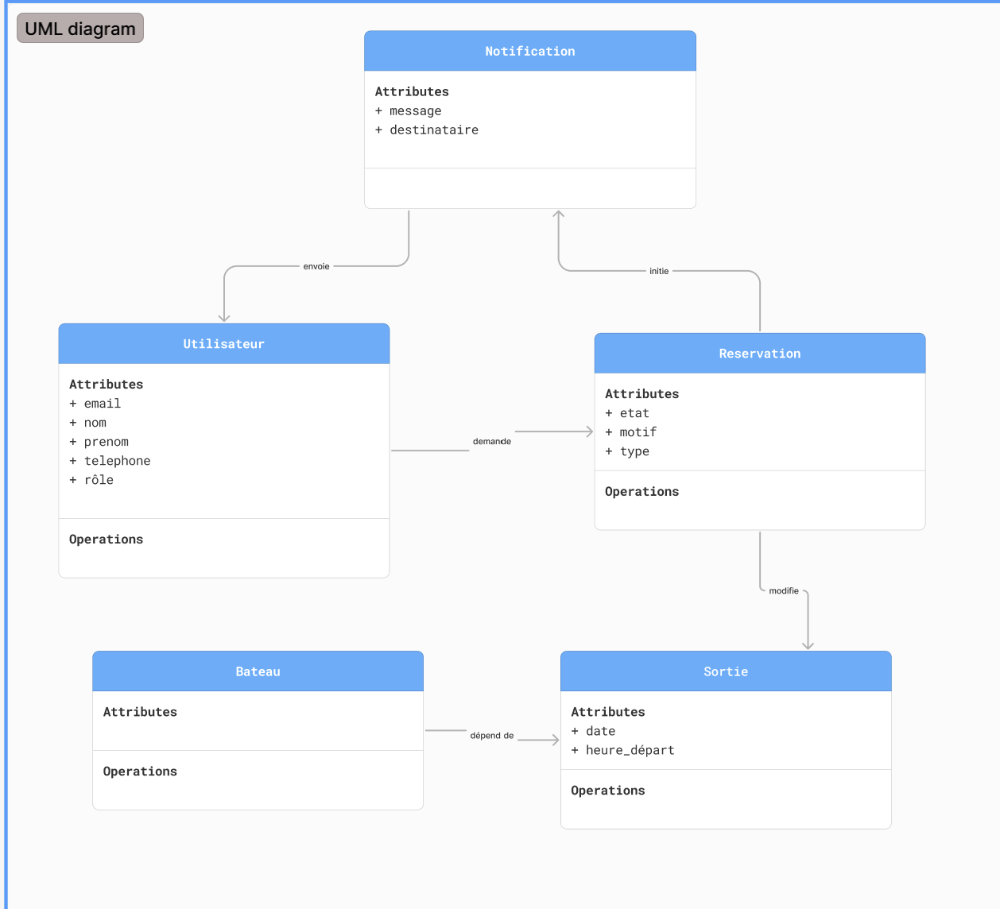
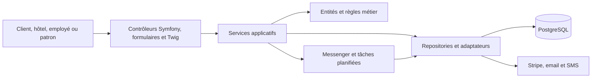

# Présentation de la conception — TI Baleine App

**Version :** v1  
**Date :** 20/08/2026  
**Équipe :** 200ping  
**Source principale :** cahier des charges V5  
**Statut :** premier jet de support de présentation

> Ce document rassemble les schémas de conception réellement présents dans le
> dépôt. Une information absente ou non validée n'est pas complétée par
> hypothèse. Les écarts repérés sont recensés dans le rapport de contrôle final.

## 1. Fil conducteur

La conception peut être présentée dans cet ordre :

1. les acteurs et leurs cas d'utilisation ;
2. les parcours sensibles sous forme de séquences ;
3. les concepts métier dans le MCD ;
4. leur traduction en tables dans le MLD ;
5. le modèle physique disponible ;
6. les classes métier actuellement dessinées ;
7. l'architecture cible ;
8. la validation par les CASE et les tests.

## 2. Contexte du projet

TI Baleine App doit prendre en charge les réservations de sorties, les créneaux
et capacités des bateaux, les acomptes et soldes, les annulations, les
notifications météo, les réservations des hôtels et les documents de paiement.

La conception courante distingue quatre rôles métier :

| Acteur | Responsabilité présentée |
|---|---|
| Client | Consulte les créneaux, réserve, paie et consulte ses réservations. |
| Hôtel | Réserve jusqu'à 6 places, hors privatisation, avec facturation mensuelle. |
| Employé | Consulte les réservations en lecture seule. |
| Patron | Gère les réservations, paiements sur place, annulations et opérations de l'entreprise. |

Références : [cahier V5](cahiers_des_charges/Cahier_des_charges_200ping_V5.md),
[MCD V3](mcd/mcd-V3.md), [architecture](architecture.md),
[ADR-007](adr/ADR-007-cycle-de-vie-reservation-etat-statut.md) (état et statut
de paiement séparés) et [ADR-008](adr/ADR-008-idempotence-paiements.md)
(idempotence des paiements en ligne).

## 3. Diagramme de cas d'utilisation

**Version disponible la plus récente :** V2, au format Draw.io et SVG.

### Lecture proposée

Le diagramme met en relation les acteurs `Client`, `Hôtel`, `Employé` et
`Patron` avec les fonctions de réservation, consultation, modification,
annulation, paiement, authentification et gestion des créneaux.

Sources :

- [source Draw.io](<cas_utilisation/v2/Tibaleine cas d'utilisation.drawio>) ;
- [rendu SVG](<cas_utilisation/v2/Tibaleine cas d'utilisation.drawio.svg>).

> Point de vigilance : aucun fichier PlantUML de cas d'utilisation n'est présent
> alors que `docs/uml/README.md` prévoit un fichier `use-cases.puml`.

## 4. Diagrammes de séquence

Les séquences montrent l'ordre des échanges entre les acteurs, le système et les
services externes. Les sources les plus récentes ne disposent pas toutes d'un
rendu image.

### 4.1 Réservation avec acompte — sources V3

Le parcours V3 est découpé en trois sources :

- [réservation à plus de 24 heures — partie 1](uml/sequences/v3/reservationv3_1.puml) ;
- [paiement du solde entre H-24 et H-12 — partie 2](uml/sequences/v3/reservationv3_2.puml) ;
- [réservation à moins de 12 heures](uml/sequences/v3/revervation12h.puml).

Les étapes exprimées dans ces fichiers sont :

1. demande de réservation et blocage temporaire des places ;
2. saisie et vérification des informations ;
3. paiement de l'acompte ;
4. confirmation de la réservation ;
5. paiement ultérieur du solde selon l'échéance.

> Statut pour la présentation : sources disponibles, mais rendu V3 absent et
> incohérences V5 relevées dans le rapport de contrôle. Ne pas présenter ces
> trois fichiers comme définitivement validés avant correction.

### 4.2 Annulation

La version la plus récente présente dans le dossier est la
[séquence d'annulation V2](uml/sequences/v2/annulation.puml).

Elle représente la demande du client, l'information du patron, la possibilité
d'un report et le traitement d'un remboursement selon le délai.

Le seul rendu image disponible correspond à une version historique :

> Statut pour la présentation : historique. La source mentionne le cahier V2 et
> représente un remboursement envoyé directement au prestataire de paiement,
> alors que le cahier V5 indique un traitement manuel par le patron.

### 4.3 Consultation par l'employé

Source courante disponible :
[consultation des réservations V2](uml/sequences/v2/consultation-reservations.puml).

Le parcours vérifie la connexion de l'employé, l'accès à une vue de suivi en
lecture seule et le refus d'une tentative de modification.

### 4.4 Réservation hôtel

Une source V2 existe dans
[reservationHotelV2](uml/sequences/v2/reservationHotelV2), mais le fichier ne
porte pas l'extension `.puml`.

Le parcours couvre les deux possibilités indiquées dans le fichier : réservation
de l'hôtel sur le site ou création par le patron après un contact direct. Il
rappelle la limite de 6 places, l'interdiction de privatisation, la remise de
15 % et la facturation en fin de mois.

Le rendu disponible est historique :

## 5. MCD — modèle conceptuel de données

**Version courante :** [MCD V3](mcd/mcd-V3.md), accompagné de sa
[source DBML](mcd/mcd-V3.dbml).

Le MCD présente huit concepts : `Utilisateur`, `Bateau`, `Sortie`,
`Réservation`, `Paiement`, `Tarif`, `Notification` et `Document`.

### Points essentiels à expliquer

- une réservation appartient à un utilisateur et concerne une sortie ;
- une sortie utilise un bateau disposant d'une capacité ;
- une réservation peut donner lieu à plusieurs opérations financières ;
- l'état de la réservation est séparé du statut du paiement — décision
  documentée dans [ADR-007](adr/ADR-007-cycle-de-vie-reservation-etat-statut.md),
  qui remplace `ADR-003` ;
- chaque paiement porte une référence externe unique pour éviter un double
  encaissement — décision documentée dans
  [ADR-008](adr/ADR-008-idempotence-paiements.md) ;
- un document peut couvrir plusieurs réservations dans le cas d'une facture
  mensuelle d'hôtel.

## 6. MLD — modèle logique de données

**Version courante :** [MLD V3](mld/mld-V3.md).

Le MLD traduit les huit concepts du MCD en tables et précise les clés primaires,
clés étrangères, valeurs nullables et contraintes d'unicité.

| Table | Rôle principal | Relations principales |
|---|---|---|
| `Utilisateur` | Porte l'identité et le rôle. | Possède des réservations et reçoit des notifications. |
| `Bateau` | Porte le nom et la capacité. | Organise des sorties et peut déterminer un tarif de privatisation. |
| `Sortie` | Représente un créneau daté. | Appartient à un bateau et reçoit des réservations. |
| `Reservation` | Porte les participants, montants et statuts. | Référence un utilisateur, une sortie et éventuellement un document. |
| `Paiement` | Trace acompte, solde, complément ou remboursement. | Référence une réservation. |
| `Tarif` | Porte le montant par type et catégorie. | Peut référencer un bateau. |
| `Notification` | Trace le canal, le contenu et la date d'envoi. | Peut référencer utilisateur, réservation et sortie. |
| `Document` | Représente justificatif ou facture. | Peut couvrir plusieurs réservations. |

Les contraintes importantes décrites dans le MLD sont notamment l'unicité de
l'email utilisateur, de la référence externe d'un paiement et de la référence
d'un document.

## 7. MPD — modèle physique disponible

Sources disponibles : [PlantUML](mpd/MPD.puml), [Draw.io](mpd/MPD.drawio) et
[rendu SVG](mpd/MPD.svg).

> Statut pour la présentation : illustration disponible, mais elle ne correspond
> pas complètement au MLD V3. Les différences sont détaillées dans le rapport de
> contrôle ci-dessous.

## 8. Diagrammes de classes disponibles

Deux illustrations sont présentes, sans numéro de version ni source PlantUML.

### 8.1 Vue générale

Cette illustration relie `Utilisateur`, `Réservation`, `Sortie`, `Bateau`,
`Tarif`, `Paiement` et `Notifications`.

Source : [Draw.io](<diagramme_de_classe/diagramme inventé.drawio>).

### 8.2 Vue centrée sur l'annulation

Cette vue contient `Utilisateur`, `Réservation`, `Sortie`, `Bateau` et
`Notification`, avec les liens utilisés pour décrire une demande et une
notification d'annulation.

> Statut pour la présentation : illustrations historiques ou partielles. Elles
> ne portent pas tous les attributs du MCD V3, notamment le statut de paiement,
> les montants courant/initial, les documents et les traces financières.

## 9. Architecture cible

La [documentation d'architecture](architecture.md) décrit une application web
Symfony monolithique rendue côté serveur. Les services applicatifs orchestrent
les cas d'utilisation, le domaine porte les règles métier et l'infrastructure
isole PostgreSQL ainsi que les services externes.

> Cette architecture est une cible de conception. L'application Symfony n'est
> pas encore implémentée dans `src/`.

Les services applicatifs de paiement devront respecter l'idempotence décrite
dans [ADR-008](adr/ADR-008-idempotence-paiements.md) : toute confirmation de
paiement (webhook Stripe ou saisie du patron) doit être vérifiée avant
encaissement pour éviter un double paiement ou une double décrémentation des
places.

## 10. Validation de la conception par les tests

Le rapport courant indique :

- 99 CASE applicables et automatisés ;
- 27 anciens CASE remplacés par leurs amendements A1 ;
- 99 tests réussis sur 99 ;
- 10 thèmes prioritaires au vert.

Voir le
[rapport de tests daté](test-reports/rapport-tests-2026-08-20_20-16-21.md).

Les tests exécutent les prototypes PHP situés dans `tests/`. Ils valident la
conception actuelle, pas encore une application Symfony de production.

## 11. Rapport de contrôle du support V1

### 11.1 Éléments utilisables

| Élément | Version | État pour la présentation |
|---|---:|---|
| Cas d'utilisation | V2 | Rendu SVG présent ; utilisable avec une réserve sur l'absence de source PlantUML. |
| MCD | V3 | Document courant et représentation Mermaid disponibles. |
| MLD | V3 | Document courant, tables et relations décrites. |
| Architecture | V1 | Vue cible disponible ; rappeler que l'application n'est pas implémentée. |
| Tests | Rapport du 20/08/2026 | 99/99 tests verts sur les prototypes. |

### 11.2 Éléments absents ou à corriger

1. **Cas d'utilisation :** aucun `use-cases.puml` n'est présent ; seuls Draw.io et
   SVG existent pour la V2.
2. **Diagramme de classes :** aucun `domain.puml` ni diagramme explicitement
   versionné V3 n'est présent. Les deux images existantes sont incomplètes par
   rapport au MCD V3.
3. **Séquences V3 :** aucun rendu SVG/PNG V3 n'est présent.
4. **Séquence réservation V3 partie 1 :** elle utilise l'état de réservation
   « Payé » après l'acompte. Le cahier V5 sépare l'état `réservée` du statut
   `acompte payé`.
5. **Séquence réservation V3 partie 2 :** elle utilise encore l'état « Payé » et
   fait passer la réservation à « Réalisée » lors du paiement sur place, avant
   que la prestation soit indiquée comme effectuée.
6. **Séquence à moins de 12 heures :** elle représente un paiement intégral en
   ligne, alors que le cahier V5 prévoit l'acompte en ligne puis le solde sur
   place à moins de H-12.
7. **Séquence annulation :** la version disponible cite le cahier V2 et montre
   un remboursement déclenché automatiquement vers le prestataire ; la V5 indique
   que le patron traite manuellement le remboursement.
8. **Réservation hôtel V2 :** le fichier source ne porte pas l'extension `.puml`.
9. **MPD :** le modèle physique ne contient pas encore tous les éléments du MLD
   V3 : `statut_paiement`, `montant_courant`, référence externe et dates du
   paiement. Il contient aussi une double référence Réservation/Paiement et les
   libellés historiques `date_emeission` et `resservation`.
10. **MCD/MLD :** la relation entre `Document` et `Reservation` doit être relue
    avant implémentation pour confirmer les cardinalités exactes des documents
    individuels et des factures mensuelles multi-réservations.
11. **Rendus :** les images disponibles dans `docs/uml/images/` correspondent aux
    anciennes séquences, pas aux sources V3.

### 11.3 Ordre conseillé pour la présentation actuelle

Pour ce premier jet, présenter sans réserve particulière :

1. le contexte et les acteurs ;
2. le cas d'utilisation V2 en précisant sa version ;
3. le MCD V3 ;
4. le MLD V3 ;
5. l'architecture cible ;
6. les résultats des tests.

Présenter les séquences, le MPD et les diagrammes de classes comme des travaux de
conception existants mais encore à harmoniser avec la V5, tant que les écarts du
§11.2 ne sont pas corrigés.

